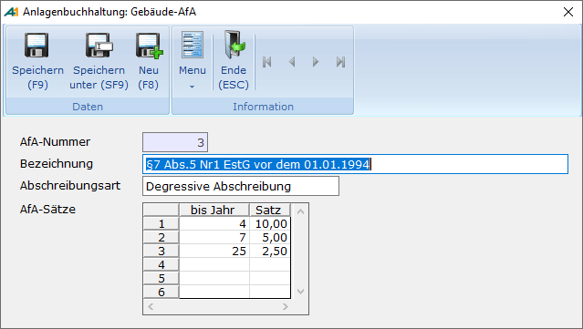

# Gebäude-AfA Stammdaten

<!-- source: https://amic.de/hilfe/_gebudeafastammdaten.htm -->

Hauptmenü > Anlagenbuchhaltung > Stammdaten > Gebäude-AfA

Direktsprung **[ANKGE]**

Auf Gebäude ist grundsätzlich sowohl lineare als auch degressive AfA möglich. Für ein nach dem 31.12.2005 hergestelltes oder angeschafftes Gebäude ist nur noch lineare AfA zulässig.

<strong>HINWEIS<em>:</em></strong><em> Bei der Verwendung der Gebäude-AfA werden zur Bestimmung der bereits errechneten AfA-Zeiträume die Geschäftsjahresstammdaten herangezogen, daher ist es notwendig, dass alle Geschäftsjahre eingerichtet sind.</em>

Die Gebäude-AfA ist sowohl für Lineare als auch für degressive AfA implementiert. Das besondere an der degressiven Gebäude-AfA ist, dass sich die AfA – Sätze im Laufe der Lebensdauer ändern. Bei Linearer AfA kann jedoch nur ein Prozentsatz angegeben werden.

Diese Staffel wird unter dem Menüpunkt „Gebäude-AfA“ erfasst. In dem folgenden Beispiel sieht man die AfA-Sätze, die laut § 7 Abs. 5 Nr. 1 EStG für Gebäude, die vor dem 01.01.1994 angeschafft wurden gelten.

Die 10% gelten für das Jahr der Fertigstellung sowie für die folgenden drei Jahren, also trägt man hier eine 4 ein.

Ab dem 5. bis zum 7. Jahr gilt der Satz 5%,

Bis zum Ende der Nutzungsdauer - also bis zum 25. Jahr - gilt dann nur noch ein Satz von 2,5 %  
Im Anlagegut hinterlegt man nur noch die „AfA-Nummer“ und die Prozentsätze werden dann automatisch gezogen.
