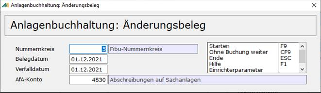
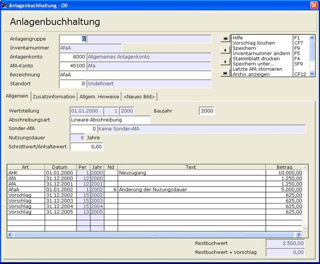

# Absetzung für außergewöhnliche Abnutzung / AfaA

<!-- source: https://amic.de/hilfe/_absetzungfrauergewhn.htm -->

Die Absetzung für außergewöhnliche Abnutzung (AfaA) entspricht der außerplanmäßigen Abschreibung des § 253 Abs2 HGB, wobei mit der AfaA regelmäßig ein Substanzverlust einhergeht, der sich auf die Restnutzungsdauer auswirkt. Man muss hier zusätzlich zum AfaA Betrag auch die neue Lebensdauer – Achtung: Nicht die neue Restnutzungsdauer – erfassen.

AfaA wird in der Anlagenbuchhaltung in der Historie über die Art **AfaA** erfasst. Es wird dabei automatisch ein Beleg in die Primanota der Finanzbuchhaltung gestellt. Dazu werden beim Speichern des Anlagegutes noch ein paar Werte abgefragt:  

In dem folgenden Beispiel wurde ein Anlagegut mit einer Nutzungsdauer von 8 Jahren für 10.000,00 Euro angeschafft. Nach 2 Jahren wurde eine AfaA durchgeführt und die Nutzungsdauer mit 6 Jahren neu festgelegt.

