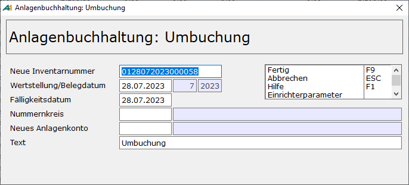

# Anzahlungen

<!-- source: https://amic.de/hilfe/_anzahlungen.htm -->

Anzahlungen oder Abschlagszahlungen werden im Allgemeinen auf einem Konto „geleistete Anzahlungen und Anlagen im Bau“ geführt. Nach Fertigstellung der Anlage werden dann die geleisteten Anzahlungen auf ein entsprechendes Anlagenkonto umgebucht. Sind für diese “Anlage im Bau“ mehrere Datensätze im Anlagenstamm erfasst worden, so will man natürlich diese trotzdem zu einem Anlagegut zusammenfassen. Dafür existiert in der Anwendung „Anlagenstamm“ in der Variante „Anlagenkartei“ die Funktion **Umbuchen**. Man markiert ein oder mehrere Anlagegüter, die man zusammenfassen möchte. Anschließend führt man die Funktion **Umbuchen** aus. Es öffnet sich die eine Maske, in der einige Werte abgefragt werden.

Anschließend öffnet sich sofort die Maske des „neuen“ Anlagegutes, in der man dann ggf. die fehlenden Werte nachtragen bzw. die vorbelegten Werte ändern kann. Vorbelegt werden diese Werte immer mit den Werten des zuerst markierten Datensatzes. In der Historie sind alle Anlagegüter als AHK-Umbuchung wiederzufinden, aus denen sich diese Umbuchung zusammensetzt.
