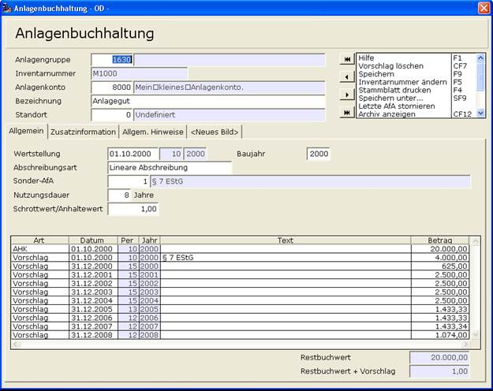

# Sonder-AfA

<!-- source: https://amic.de/hilfe/_sonderafa.htm -->

Um für ein Anlagegut Sonder-AfA errechnen zu lassen, muss man im Anlagenstamm bei Sonder-AfA eine vorher in den [Stammdaten](../sonder_afa_stammdaten.md) definierte hinterlegen. Bei der Erstellung der ersten AfA-Vorschläge wird diese dann errechnet und mit vorgeschlagen. Nach Beendigung des Begünstigungszeitraums wird dann auf Restwert-AfA umgestellt. Das folgende Beispiel zeigt ein Anlagegut, welches am 01.Oktober 2000 angeschafft wurde. Nutzungsdauer 8 Jahre, Sonder-AfA 20%

Die Sonder-AfA wird sofort errechnet. Anschließend wird die Anteilige AfA für das Jahr 2000 ermittelt. Die folgenden vier Jahre wird die Sonder-AfA bei der Berechnung der Bemessungsgrundlage nicht berücksichtigt. Nach Beendigung des Begünstigungszeitraums wird dann auf Restwert-AfA umgeschaltet.

Die Sonder-AfA erscheint im Anlagenspiegel als Summe zusammen mit der normalen Abschreibung.
