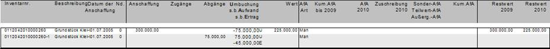

# Teilverkauf

<!-- source: https://amic.de/hilfe/_teilverkauf.htm -->

Man kann Anlagegüter nur vollständig verkaufen. Jetzt sind aber Geschäftsvorfälle, bei denen nur ein Teil des Anlagegutes verkauft wird durchaus denkbar.

Beispiel: Von einem Grundstück (4000 qm), dass mit 300.000,00 Euro geführt wird, sollen 1000 qm verkauft werden.

Um diesen Geschäftsvorfall abzubilden muss man zuerst ¼ des Wertes umbuchen. Anschließend kann dieser Teil dann voll verkauft werden. Auch können dann die sonstige betriebliche Erträge / Aufwendungen erfasst werden. Verkauft man also das Anlagengut mit einem s.b.Ertrag von 45.000,00 Euro so sieht der Anlagenspiegel wie folgt aus.

