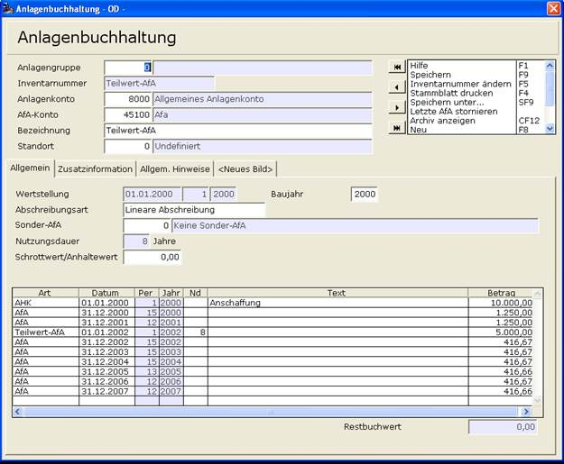

# Teilwert-AfA

<!-- source: https://amic.de/hilfe/_teilwertafa.htm -->

Voraussetzung für die Inanspruchnahme der Teilwertabschreibung ist, dass die Wertminderung von Dauer und nicht nur vorübergehend ist. Die Teilwertabschreibung kann dann vorgenommen werden, wenn der Teilwert niedriger ist als der auf Grund der planmäßig vorgenommenen Abschreibung sich ergebende Restbuchwert. Bei Vornahme einer Teilwert-AfA ist sowohl der Restwert der Anlage als auch die Restnutzungsdauer neu zu schätzen.

Teilwert-AfA wird in der Anlagenbuchhaltung in der Historie über die Art **Teilwert-AfA** erfasst. Es wird dabei automatisch ein Beleg in die Primanota der Finanzbuchhaltung gestellt. Dazu werden beim Speichern des Anlagegutes noch ein paar Werte abgefragt:

    
Bei Erfassung der Teilwert-AfA kann man zusätzlich eine neue Lebensdauer – Achtung: Nicht die neue Restnutzungsdauer – erfassen. In dem folgenden Beispiel wurde ein Anlagegut mit einer Nutzungsdauer von 8 Jahren für 10.000,00 Euro angeschafft. Nach 2 Jahren wurde eine Teilwert-AfA durchgeführt. Da die Restnutzungsdauer sich nicht geändert hat, braucht man die vorgeschlagene Nutzungsdauer nur zu bestätigen.

