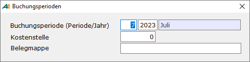

# Abfrage der Buchungsperiode

<!-- source: https://amic.de/hilfe/abfragederbuchungsperiode.htm -->

Hauptmenü > Finanzbuchhaltung > Erfassung > Belegerfassung

Direktsprung **[FIBE]**

Der Einstieg in die Belegerfassung beginnt mit der Eingabe der Buchungsperiode (Periode/Jahr).

Die aktuelle Periode und das Jahr werden vorbelegt: Periode 11 und Jahr 2011. Die Periode wird anschließend im Grundbildschirm als „Aktive Periode“ angezeigt.

Ob diese Kostenstelle abgefragt wird, kann in dieser Maske mit dem Einrichterparameter „Kostenstellenvorbelegung abfragen?“ ab- bzw. angeschaltet werden.  
Die Kostenstelle wird abgefragt und als Vorbelegung in der Belegerfassung verwendet, wenn zu diesem Sachkonto keine Kostenstelle im Sachkontenstamm als Vorbelegung hinterlegt ist.

Ob und wie die Belegmappe abgefragt wird, wird in dem darunterliegenden Bildschirm mit dem Einrichterparameter „Belegmappe abfragen“ eingestellt. Hier existieren drei Ausprägungen:

- Nicht aktiv. Es wird ohne Belegmappe gearbeitet. Dies ist die Vorbelegung
- Belegmappe einmal zentral abfragen. Die Belegmappe wird nur in diesem Abfragefenster abgefragt und ansonsten im Grundbildschirm und in der Belegerfassung nur angezeigt.
- Belegmappe in der Belegerfassung abfragen. Die Belegmappe kann zusätzlich in der Belegerfassung noch geändert werden. Vorbelegt wird sie mit der in diesem Abfragefenster angegeben Mappe.

Näheres zum Thema Periodeneinteilung befindet sich im Abschnitt "Firmenstamm". Wenn dort eine andere Einteilung als Monat vorgenommen wurde, bezieht sich die Eingabe natürlich auf diese Einteilung.

**Sämtliche erfassten Bewegungen werden für diese Periode abgespeichert und für diese Periode ausgewertet (USt- Voranmeldung, Bilanz, GuV, Saldenlisten...).**

Während der Belegerfassung besteht jedoch jederzeit die Möglichkeit über die Funktion ***Periode Ändern*** **F10** die Buchungsperiode für einen Beleg zu verändern.

Nach Eingabe der Buchungsperiode wird in den eigentlichen Erfassungsbildschirm verzweigt.
