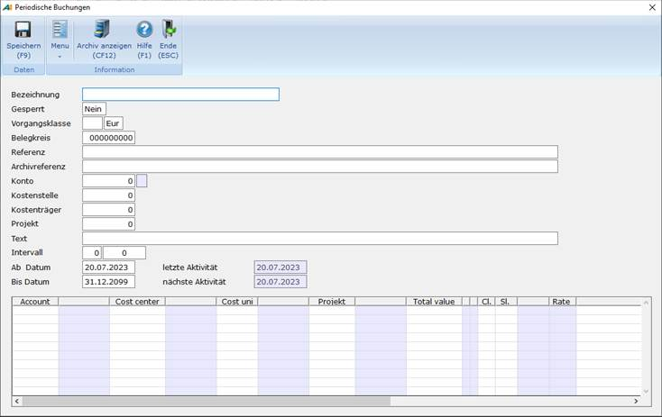
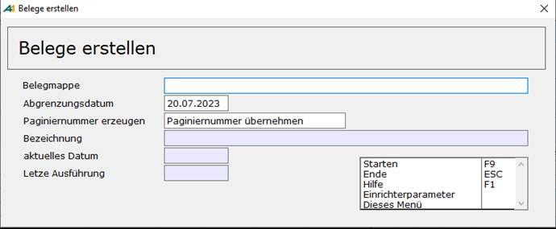

# Periodische Buchungen

<!-- source: https://amic.de/hilfe/periodischebuchungen.htm -->

Hauptmenü > Finanzbuchhaltung > Erfassung > Periodische Buchungen

Direktsprung **[WZA]**

Ständig wiederkehrende Buchungen (z.B. Mietrechnungen), monatliche Umbuchungen (z.B. einmalige Versicherungsrechnungen) oder kalkulatorische Buchungen (z.B. AfA) können hier als Stammdaten mit Konto / Gegenkonto, Buchungstext, Betrag, Turnus und Laufzeit angelegt werden. In der Anwendung „**Periodische Buchungen“** stehen zwei Varianten zur Verfügung

1. Wiederkehrende Belege  
Hier werden alle erfassten Daten angezeigt und können bearbeitet werden.

2. Fällig Belege  
Es werden die zum eingegebenen Stichtag anliegenden Buchungen angezeigt.

**Periodische Buchungen erfassen**

  <table>
    <tbody>
      <tr>
        <td>
          
<strong>Feld</strong>

        </td>
        <td>
          
<strong>Beschreibung</strong>

        </td>
      </tr>
      <tr>
        <td>
          
Bezeichnung

        </td>
        <td>
          
Bezeichnung der periodischen Buchung zur einfacheren Identifikation. Hier kann z.B. ein Text wie „KFZ-Versicherung HUK KI DB-2100“ hinterlegt werden.

        </td>
      </tr>
      <tr>
        <td>
          
Gesperrt

        </td>
        <td>
          
Wenn einmal Unklarheiten bei Buchungen existieren und man möchte nicht, dass versehentlich diese Buchungen in die Primanota gelangen, so kann man hier eine Sperre setzen. Beim Erstellen der Belege wird dann dieser Beleg nicht berücksichtigt.

        </td>
      </tr>
      <tr>
        <td>
          
Vorgangsklasse

        </td>
        <td>
          
Die Klasse bestimmt, was für eine Belegart später erstellt wird und ggf. wie die Stellung des Sollhaben-Kennzeichens ist. Die Klasse entspricht der Klasse, wie man sie von der Belegerfassung kennt. Folgende Klassen stehen zur Verfügung:

          <table>
            <tbody>
              <tr>
                <th>
                  <ul>
                    <li>ZA</li>
                  </ul>
                </th>
                <th>Zahlungseingang bzw. Zahlungsausgang. Einschränkend gilt hier analog zur Belegerfassung, dass im Hauptkonto nur Sachkonten erfasst werden können.</th>
              </tr>
              <tr>
                <td>
                  <ul>
                    <li>ER</li>
                  </ul>
                </td>
                <td>Eingangsrechnung. Es sind im Hauptkonto nur Personenkonten und im Gegenkonto nur Sachkonten zugelassen. Das Sollhabenkennzeichen ist vorbelegt und kann nicht geändert werden.</td>
              </tr>
              <tr>
                <td>
                  <ul>
                    <li>EG</li>
                  </ul>
                </td>
                <td>Eingangsgutschrift. Es sind im Hauptkonto nur Personenkonten und im Gegenkonto nur Sachkonten zugelassen. Das Sollhabenkennzeichen ist vorbelegt und kann nicht geändert werden.</td>
              </tr>
              <tr>
                <td>
                  <ul>
                    <li>AR</li>
                  </ul>
                </td>
                <td>Ausgangsrechnung. Es sind im Hauptkonto nur Personenkonten und im Gegenkonto nur Sachkonten zugelassen. Das Sollhabenkennzeichen ist vorbelegt und kann nicht geändert werden.</td>
              </tr>
              <tr>
                <td>
                  <ul>
                    <li>AG</li>
                  </ul>
                </td>
                <td>Ausgangsgutschrift. Es sind im Hauptkonto nur Personenkonten und im Gegenkonto nur Sachkonten zugelassen. Das Sollhabenkennzeichen ist vorbelegt und kann nicht geändert werden.</td>
              </tr>
              <tr>
                <td>
                  <ul>
                    <li>SO</li>
                  </ul>
                </td>
                <td>Sonstige Buchung, bei dem das Hauptkonto im Soll oder im Haben stehen kann Für diese Klasse gilt, wenn das Hauptkonto ein Personenkonto ist, dann sind im Gegenkonto nur Sachkonten zugelassen.</td>
              </tr>
            </tbody>
          </table>
        </td>
      </tr>
      <tr>
        <td>
          
Währung

        </td>
        <td>
          
In welcher Währung soll der Beleg erstellt werden. Bei allen Belegarten gilt die Währung für den gesamten Beleg.

        </td>
      </tr>
      <tr>
        <td>
          
Belegkreisnummer

        </td>
        <td>
          
Für „Periodische Buchungen“ muss ein Belegkreis eingetragen werden. Dieser Belegkreis wird nicht aus der „Vorgangszuordnung Finanzbuchhaltung“ vorgeschlagen.

        </td>
      </tr>
      <tr>
        <td>
          
Referenz  

        </td>
        <td>
          
Diese Referenz wird so wie sie ist ohne Prüfung beim Erstellen des Beleges übernommen.

        </td>
      </tr>
      <tr>
        <td>
          
Archivreferenz

        </td>
        <td>
          
Referenznummer für das Archiv. Diese Referenz wird nicht an den Fibu-Beleg weitergereicht.

        </td>
      </tr>
      <tr>
        <td>
          
Kostenstelle

        </td>
        <td>
          
<a href="../kostenrechnung/kostenstellen.md">Kostenstellen</a> werden so vorgeschlagen, wie sie für das Hauptkonto im Sachkontenstamm hinterlegt sind. Ist die Kostenstelle im Sachkontenstamm gesperrt oder ist das Hauptkonto ein Personenkonto, ist hier keine Erfassung möglich.

        </td>
      </tr>
      <tr>
        <td>
          
Kostenträger

        </td>
        <td>
          
<a href="../kostenrechnung/kostentraeger.md">Kostenträger</a> werden so vorgeschlagen, wie sie für das Hauptkonto im Sachkontenstamm hinterlegt sind. Ist der Kostenträger im Sachkontenstamm gesperrt oder ist das Hauptkonto ein Personenkonto, ist hier keine Erfassung möglich.

        </td>
      </tr>
      <tr>
        <td>
          
Kostenobjekt

        </td>
        <td>
          
<a href="../kostenrechnung/kostenobjekte/index.md">Kostenobjekte</a> werden so vorgeschlagen, wie sie für das Hauptkonto im Sachkontenstamm hinterlegt sind. Ist das Kostenobjekt im Sachkontenstamm gesperrt oder ist das Hauptkonto ein Personenkonto, ist hier keine Erfassung möglich.

        </td>
      </tr>
      <tr>
        <td>
          
Text

        </td>
        <td>
          
Belegtext, der beim Erstellen dem Hauptkonto zugeordnet wird.

        </td>
      </tr>
      <tr>
        <td>
          
Intervall

        </td>
        <td>
          
Der Interwall legt fest, wann der nächste Ausführungstermin ist. Für das Intervall lässt sich Tag, Woche, Monat und Jahr als Einheit angeben.

        </td>
      </tr>
      <tr>
        <td>
          
Ab Datum

        </td>
        <td>
          
Tag der ersten Ausführung.

        </td>
      </tr>
      <tr>
        <td>
          
Letzte Aktivität/Nächste Aktivität  

        </td>
        <td>
          
Diese Werte werden nur angezeigt. An ihnen kann abgelesen werden, wann die letzte Buchung ausgelöst worden ist und wann die nächste Buchung ansteht. Bei Neuanlage einer „periodischen Buchung“ werden diese Daten immer auf das Ab-Datum gesetzt

        </td>
      </tr>
    </tbody>
  </table>

Tabelle für Gegenpositionen:

| | Beschreibung |
| --- | --- |
| Konto | Gegenkonto.  |
| Kostenstelle | [Kostenstellen](../kostenrechnung/kostenstellen.md) werden so vorgeschlagen, wie sie für das Gegenkonto im Sachkontenstamm hinterlegt sind. Ist die Kostenstelle im Sachkontenstamm gesperrt oder handelt es sich beim Gegenkonto um ein Personenkonto, ist hier keine Erfassung möglich.  |
| Kostenträger | [Kostenträger](../kostenrechnung/kostentraeger.md) werden so vorgeschlagen, wie sie für das Gegenkonto im Sachkontenstamm hinterlegt sind. Ist der Kostenträger im Sachkontenstamm gesperrt oder handelt es sich beim Gegenkonto um ein Personenkonto, ist hier keine Erfassung möglich.  |
| Kostenobjekt | [Kostenobjekte](../kostenrechnung/kostenobjekte/index.md) werden so vorgeschlagen, wie sie für das Gegenkonto im Sachkontenstamm hinterlegt sind. Ist das Kostenobjekt im Sachkontenstamm gesperrt oder handelt es sich beim Gegenkonto um ein Personenkonto, ist hier keine Erfassung möglich.  |
| Betrag | Der dem Gegenkonto zuzuordnende Betrag. Er wird je nach Steuerklasse als brutto oder Nettobetrag interpretiert.  |
| Klasse/Schlüssel | Steuerklasse und Steuerschlüssel werden so vorgeschlagen, wie sie für das Gegenkonto im Sachkontenstamm hinterlegt sind. Sind Steuerklasse und Steuerschlüssel im Sachkontenstamm gesperrt oder handelt es sich beim Gegenkonto um ein Personenkonto, ist auch hier keine Erfassung möglich.  |
| Text | Belegtext, der beim Erstellen dem jeweiligen Gegenkonto zugeordnet wird  |

#### Beleg erstellen

Die Funktion „Beleg erstellen“ bezieht sich auf die in der Auswahlliste angezeigten Daten. Jedoch werden von den ausgewählten Daten nur die zu Belegen umgewandelt, bei denen das nächste Ausführungsdatum vor dem **Abgrenzungsdatum** liegt.

Im Feld „Paginiernummer erzeugen“ kann man zwischen drei Optionen wählen:

0. **Ohne Paginiernummer**. Es wird keine Paginiernummer erzeugt.

1. **Neue Paginiernummer erzeugen**. Es wird für jeden Beleg eine neue Archivreferenz erzeugt.

2. **Paginiernummer übernehmen**. Ist in der periodischen Buchung eine Archivreferenz erfasst worden, so wird diese in den Fibubeleg übernommen.

Zusätzlich existiert ein Einrichterparameter „Alle Belege in diesem Zeitraum erzeugen?“. Es kann vorkommen, dass bis zum Abgrenzungsdatum mehrere Belege erzeugt werden müssten. Ein Beispiel ist, dass man als Intervall einen Monat gewählt hat und dann bereits im Januar alle Belege für das gesamte Jahr erstellen will. Im Standardfall müsste man dann 12 Mal die Funktion ***„Beleg erstellen“*** aufrufen. Stellt man diesen Parameter auf Ja, so werden immer alle Belege bis zum Abgrenzungsdatum in einem Lauf erzeugt.
