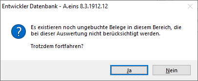
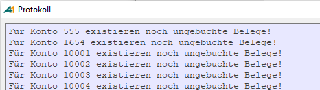
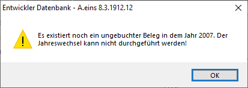
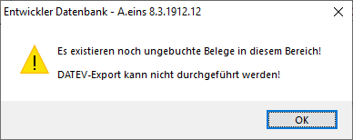

# Primanota

<!-- source: https://amic.de/hilfe/primanota.htm -->

Nachdem die Belege über die Belegerfassung erfasst wurden bzw. aus der Warenwirtschaft oder einem sonstigen System in die Finanzbuchhaltung übertragen wurden, stehen sie so lange *vorläufig* in der Primanota (frei übersetzt: erster Eintrag) bis sie endgültig verbucht werden. Die Salden sind jedoch bereits aktualisiert und stehen somit bereits – z.B. in der Konteninformation – zur Verfügung.

Dieser *vorläufige* Status bedeutet:

- Die Belege können noch geändert werden. Bei Belegen aus der A.eins-Warenwirtschaft kann nur eingeschränkt geändert werden (Erlöskonten, Kostenträger, Kostenstellen, Text). Auch bei Belegen, die vom System erstellt wurden, wie z.B. Skontobelege, sind nur diese eingeschränkten Änderungsmöglichkeiten gegeben,  
- Alle Belege können gelöscht werden. Bei Belegen aus der Warenwirtschaft wird der Übertragsmerker entsprechend zurückgesetzt. Bei automatisch erstellten Belegen aus der Finanzbuchhaltung (automatischer Zahlungsverkehr, Zinswesen, Mahnwesen, ...) wird der Buchungsmerker entsprechend zurückgesetzt. Belege, die automatisch beim Ausziffern erstellt wurden (Kursdifferenzbuchungen, Skontobuchungen) können nicht gelöscht werden. Diese Belege verschwinden wieder automatisch, wenn die Auszifferung zurückgesetzt wird (siehe OP-Verwaltung).  
- Eine Primanota kann gedruckt werden. Dazu stehen vier fest definierte Crystal-Reporte zur Verfügung.  
    

1. Primanota nach Belegart: In der A.eins-Finanzbuchhaltung werden die Belege in Belegarten unterteilt (ER, EG, AR, AG, ZA, EB, ...). In diesem Report werden die Belege nach dieser Belegart gruppiert und sortiert nach Belegart und Belegnummer aufgelistet

2. Primanota chronologisch: Die Belege werden in der Reihenfolge ausgegeben, wie sie ins System gekommen sind.

3. Primanota EURO/Fremdwährung: Die Sortierung erfolgt wie im Report Primanota nach Belegart, jedoch werden die Beträge sowohl in Buchwährung als auch in Fremdwährung ausgegeben.

4. Primanota Hauptbuch: Die erfassten Daten werden nicht Belegweise wie in den anderen Primanoten ausgegeben, sondern gruppiert und sortiert nach den Konten.

- Zudem steht noch eine Auswahlliste **Primanota** zur Verfügung. Dort können die Daten über die üblichen Mechaniken (z.B. Excelexport, Kurzliste, Quickreport, AMIC Etikettendruck) ausgegeben werden.
- Ungebuchte Belege werden bereits beim automatischen Zahlungsverkehr und beim Mahnwesen herangezogen. Zu beachten ist hier unbedingt, dass die Zahlungs- / Mahnvorschläge sich ändern, wenn die ungebuchten Belege geändert/gelöscht werden.  
- Diese nicht verbuchten Belege werden nicht zur Bilanz/GuV/Summen und Saldenliste/Umsatzsteuervoranmeldung herangezogen. Es erscheint vor dem Druck folgende Meldung:  
  
    

- Konten, für die noch ungebuchte Belege existieren, werden nicht zur Zinsabrechnung herangezogen. Es erscheint gegebenenfalls eine Meldung:  
  
    

- Ungebuchte Belege erscheinen nicht in Kontoblättern.  
- Ein Jahreswechsel kann nicht durchgeführt werden:  
  
    

- Der Datev-Export kann nicht durchgeführt werden, solange im angewählten Bereich noch ungebuchte Belege existieren:  

