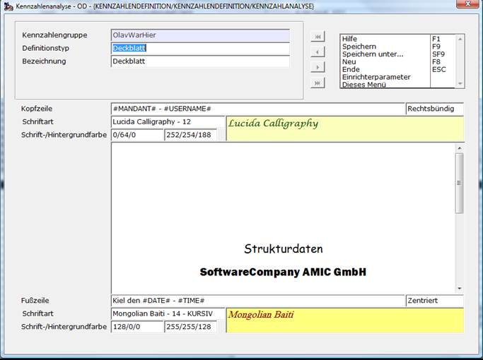
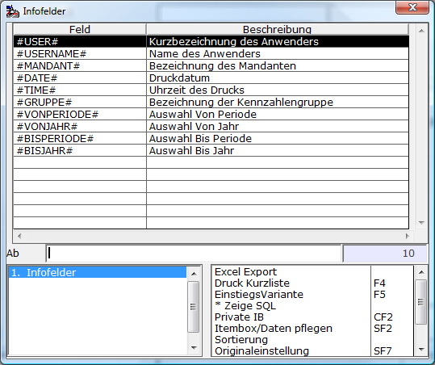

# Deckblatt

<!-- source: https://amic.de/hilfe/deckblatt.htm -->

Hauptmenü > Abschlussarbeiten > Chefcockpit > Chefcockpit-Designer > Definitionstyp **Überschriftszeile**

Direktsprung **[CCD]**

Um sich z.B. fertige Bankmappen zu erstellen, kann es wünschenswert sein, zu den Daten gleich ein Deckblatt zu definieren. Hierfür dient der Definitionstyp „**Deckblatt**“. Deckblätter erscheinen nur beim Ausdruck des Reports.

Bei dem Typen Deckblatt ist die Bezeichnung nur informatorisch. Sie erscheint nicht auf dem Crystal-Report.

Die **Kopfzeile** und die **Fußzeile** kann rechtsbündig, zentriert oder linksbündig ausgegeben werden. Die Schriftart und Schriftfarbe gelten jeweils für Fuß- bzw. Kopfzeile, da der Haupttext einzeln formatiert werden kann. Weiterhin können Informationen aus der Datenbank variabel hinterlegt werden. Dazu steht in eine Itembox zur Verfügung. Die Ausgewählten Felder werden an die Stellen im Text eingefügt, an der die Schreibmarker gerade steht.

In dem Textfeld für das Deckblatt kann dann ein beliebiger Text eingerichtet werden. Es ist möglich dort die Schriftarten per Windows-Systemdialog einzurichten.

Desweiteren sind umfassende Gestaltungsmöglichkeiten über den Windows-Standard-RTF-Editor WordPad möglich.
