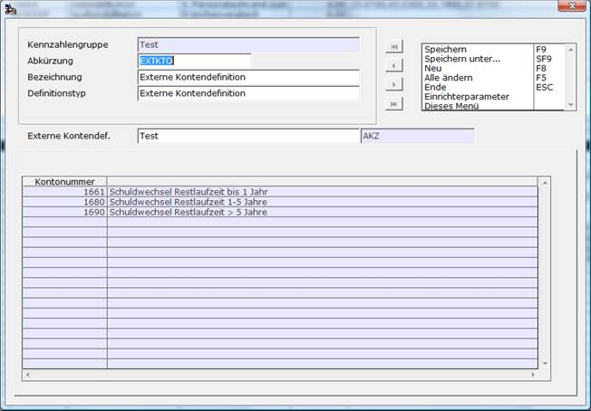

# Externe Kontendefinition

<!-- source: https://amic.de/hilfe/externekontendefinition.htm -->

Hauptmenü > Abschlussarbeiten > Chefcockpit > Chefcockpit-Designer > Definitionstyp **Externe** **Kontendefinition**

Direktsprung **[CCD]**

Bei der externen Kontendefinition handelt es sich lediglich um einen Verweis auf eine bestehende Kontendefinition. Man muss so nicht für jede Kennzahlengruppe immer wieder Kontenlisten neu erfassen. Auch erspart man sich so die Pflege verschiedener Listen, die eigentlich denselben Inhalt haben sollen, da nur die Originalliste gepflegt werden muss. In dem Feld **Externe Definition** kann man mit **F3** eine bestehende Kontenliste aus einer beliebigen Kennzahlengruppe auswählen. Will man auf die Planzahlen dieser Definition zugreifen, so muss man keine neue Liste definieren. Man stellt dem Kürzel einfach PLAN_ vorweg - also PLAN_AKZ für die Plandaten Siehe auch [Externe Kostenstellendefinition](./externe_kostenstellendefinition.md) bzw. [Externe Kostenträgerdefinition](./externe_kostentraegerdefinition.md).

