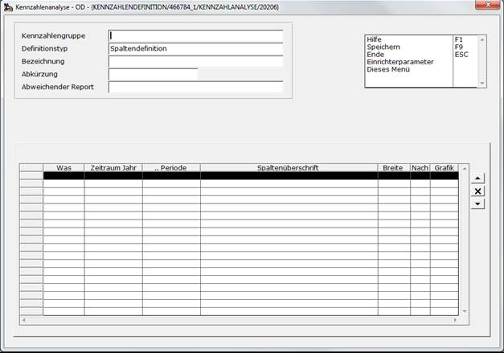

# Definition des Chefcockpits

<!-- source: https://amic.de/hilfe/definitiondeschefcockpits.htm -->

Hauptmenü > Abschlussarbeiten > Chefcockpit > Chefcockpit-Designer

Direktsprung **[CCD]**

Die Auswertungen des Chefcockpits werden in sogenannten Kennzahlengruppen zusammengefasst.

Jeder Eintrag in einer Kennzahlengruppe muss ein eindeutiges Kürzel (**Abkürzung**) haben. Auf dieses Kürzel kann dann ggf. in den Formeln zugegriffen werden.

Die Bezeichnung dient zur textlichen Identifikation einer Zeile und steht in den Auswertungen des Chefcockpits (Direktsprung **[CCA]**) in der ersten Spalte.  
    
Zur Definition von Chefcockpitauswertungen können verschiedene Bereiche definiert werden

1. Spaltendefinition.

2. Kontendefinition und externe Kontendefinition.

3. Kostenstellendefinition und externe Kostenstellendefinition

4. Kostenträgerdefinition und externe Kostenträgerdefinition

5. Zeilendefinition.

6. Überschriftszeilen.

7. Deckblatt

Über die Sortierung wird zum einen die Reihenfolge auf den Auswertungen festgelegt, zum anderen werden auch der Abkürzungen in dieser Reihenfolge angelegt. Man kann sich in einer Formel also nur auf die Formeln beziehen, die in der Sortierung vorn liegen!

Siehe auch:

- [Spaltendefinition](./spaltendefinition.md)
- [Kontendefinition](./kontendefinition.md)
- [Externe Kontendefinition](./externe_kontendefinition.md)
- [Kostenstellendefinition](./kostenstellendefinition.md)
- [Externe Kostenstellendefinition](./externe_kostenstellendefinition.md)
- [Kostenträgerdefinition](./kostentraegerdefinition.md)
- [Externe Kostenträgerdefinition](./externe_kostentraegerdefinition.md)
- [Zeilendefinition](./zeilendefinition.md)
- [Überschriftszeile](./ueberschriftszeile.md)
- [Deckblatt](./deckblatt.md)
