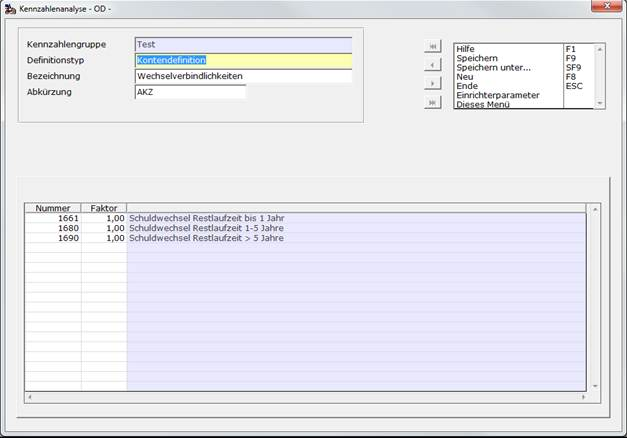

# Kontendefinition

<!-- source: https://amic.de/hilfe/kontendefinition.htm -->

Hauptmenü > Abschlussarbeiten > Chefcockpit > Chefcockpit-Designer > Definitionstyp **Kontendefinition**

Direktsprung **[CCD]**

Hier legt man eine Liste von Konten an, auf die man bei der Berechnung später zugreifen will. Im unten gezeigten Beispiel kann man später über das Kürzel AKZ auf die Summe der Wechselverbindlichkeiten in einem bestimmten Zeitraum, der sich später in einer Auswahlliste (Direktsprung **[CCA]**) angeben lässt, zugreifen. Die hier eingegebenen Konten können Sach- oder Oberkonten sein. In einer Kontendefinition kann ein Konto nur einmal erscheinen. Doppelt angegebene Konten werden nur einmal gespeichert.

Im Normalfall werden Sollsalden positiv und Habensalden negativ dargestellt. Bei der Betrachtung von GuV-Konten müsste man also das Ergebnis der Kennzahlengruppe mit -1,00 multiplizieren um Erträge positiv und Aufwendungen negativ darzustellen. Um bereits das Ergebnis in der gewünschten Form zu erhalten kann man von vornherein einen Faktor -1,00 angeben, der für die einzelnen Salden das Vorzeichen automatisch dreht.

Will man auf die Planzahlen dieser Definition zugreifen, so muss man keine neue Liste definieren. Man stellt dem Kürzel einfach PLAN_ vorweg - also PLAN_AKZ für die Plandaten. Siehe auch [Kostenstellendefinition](./kostenstellendefinition.md) bzw. [Kostenträgerdefinition](./kostentraegerdefinition.md).

