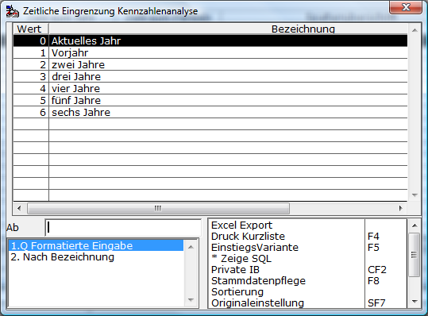
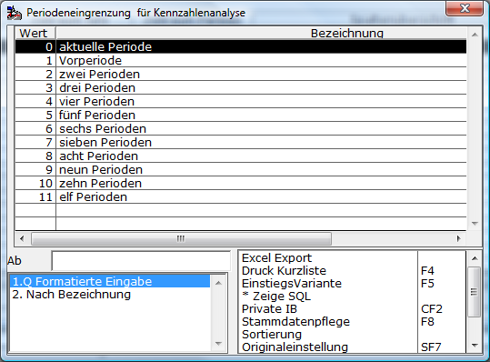

# Spaltendefinition

<!-- source: https://amic.de/hilfe/spaltendefinition.htm -->

Hauptmenü > Abschlussarbeiten > Chefcockpit > Chefcockpit-Designer > Definitionstyp **Spaltendefinition**

Direktsprung **[CCD]**

Die Spaltendefinition ist die Grundlage einer Chefcockpitauswertung. Hier legt man fest, wie viele Spalten es gibt, und was bzw. welcher Zeitraum ausgewertet werden soll. Zusätzlich kann auch ein abweichender Report festgelegt werden. Standardmäßig werden zwei Reporte angeboten: „Kennzahlanalyse.rpt“ und „Kennzahlanalyse_quer.rpt“. Für bis zu 9 Spalten wird der Report „Kennzahlanalyse.rpt“ verwendet, ansonsten der Report „Kennzahlanalyse_quer.rpt“, der im Querformat ausgedruckt wird und bis zu 12 Spalten enthalten kann. Wenn z.B. die Zahlen zu groß werden – im Standard werden sie dann umgebrochen – oder man einfach ein etwas anderes Design verwenden will, so kann man unter „**Abweichender Report“** einen privaten Report hinterlegen. Es ist dabei Sinnvoll, einen der beiden Reporte als Grundlage zu verwenden.

**Was**

Hier können zurzeit die Werte Konstante und Formel eingetragen werden. Konstanten sind fest definierte Werte, die z.B. als Vergleichswerte in die Liste eingetragen werden. Hier sind nur numerische Werte erlaubt. Diese werden mit vier Nachkommastellen gespeichert. Mit den Formeln werden die Werte in den einzelnen Zeilen und Spalten errechnet. Hier kann über die Kürzel auf Kontenlisten und bereits definierte Zeilenergebnisse zugegriffen werden. Auch können Datenbankfunktionen aufgerufen werden. Mehr zu Formeln steht unter der Dokumentation der Zeilendefinition.

**Zeitraum Jahr**

Hier kann über **F3** angegeben werden, auf welchen Zeitraum sich diese Spalte beziehen soll. In den Auswertungen wird ein bestimmter Zeitraum abgefragt. Soll sich die Spalte auf genau diesen beziehen, so gibt man hier „aktuelles Jahr“ als Zeitraum an. Soll sich die Spalte jedoch auf das Jahr beziehen, dass vor diesem Zeitraum liegt, so kann man hier „Vorjahr“ angeben. Die Werte werden dann entsprechend der Eingrenzung zusammengesucht, nur dass bei den Jahren jeweils 1 abgezogen wird. Es stehen folgende Werte zur Verfügung:

**Zeitraum Periode**

Analog zu Zeitraum Jahr kann hier für die Perioden der Zeitraum, auf den sich diese Spalte beziehen soll, angegeben werden. In den Auswertungen wird ein bestimmter Zeitraum abgefragt. Soll sich die Spalte auf genau diesen beziehen, so gibt man hier „aktuelle Periode“ als Zeitraum an. Soll sich die Spalte jedoch auf die Periode beziehen, die vor dem eingegrenzten Zeitraum liegt, so kann man hier „Vorperiode“ angeben. Die Werte werden dann entsprechend der Eingrenzung zusammengesucht, nur dass bei den Perioden jeweils 1 abgezogen wird. Es stehen folgende Werte zur Verfügung (Auswahl mit **F3**):

**Spaltenüberschrift**

Dies ist die Überschrift der Spalte in den Auswertungen.

**Breite**

Hier kann die Breite der Spalten auf dem Crystal Report festgelegt werden. Standardmäßig sind alle Spalten gleich breit und werden je nach Anzahl der Spalten gleichmäßig verteilt. Die Angabe der Breite Erfolg in zehntel Millimeter.

1 ⇨ 0,1 Millimeter

10 ⇨ 1 Millimeter

100 ⇨ 1 Zentimeter

**Nachkommastellen**

Hier wird die Anzahl der Nachkommastellen im Report pro Spalte festgelegt. Der Wert wird bereits bei der Berechnung gerundet, so dass bei Formeln die auf andere Zellen zugreifen keine Differenzen durch versteckte Nachkomastellen erscheinen können. In der Auswahlliste erscheinen die Werte dann zwar nach wie vor mit 2 Nachkommastellen, jedoch sind sie intern bereits so gerundet, wie es hier angegeben wurde.

**Grafik**

Will man, dass diese Spalte in der Grafik erscheint, so muss man hier ‚Ja‘ Eintragen. Hat man z.B. eine Spalte „Bemerkungen“, so macht es keinen Sinn diese in der Grafik auszugeben.
