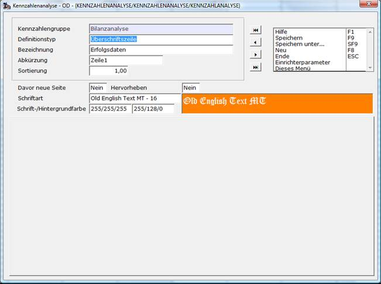
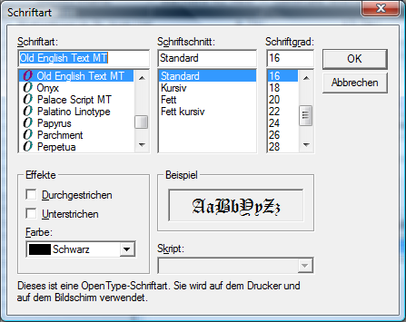
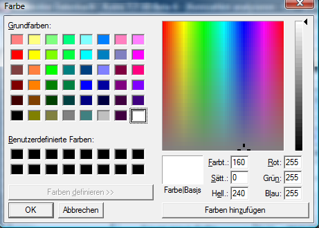
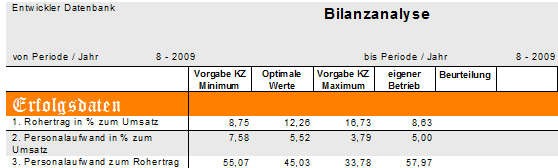

# Überschriftszeile

<!-- source: https://amic.de/hilfe/berschriftszeile.htm -->

Hauptmenü > Abschlussarbeiten > Chefcockpit > Chefcockpit-Designer > Definitionstyp **Überschriftszeile**

Direktsprung **[CCD]**

Bei Überschriftszeilen wird lediglich die Bezeichnung in der ersten Spalte der Auswertung angezeigt. Dies dient zur Abgrenzung von Bereichen.

**Davor neue Seite** und **Zeile hervorheben** sowie **Schriftart** und **Schrift-/Hintergrundfarbe** dienen zur optischen Abgrenzung im mitgelieferten Crystal Report.

Dabei bedeutet:

**Davor neue Seite**  
Bevor diese Zeile gedruckt wird, wird ein Seitenwechsel erzwungen.

**Zeile hervorheben**  
Wenn man hier Ja einträgt, wird die Schriftfarbe mit 0/0/0 und die Hintergrundfarbe mit 233/233/233 ( Grau ) vorbelegt. Zusätzlich wird diese Zeile mit einem horizontalen Linien umrandet.

**Schriftart**  
Die Schriftart, Schriftschnitt und Schriftgrad können hier festgelegt werden.  
****

**Schrift-/Hintergrundfarbe**  
Die Zeile kann beliebig farblich gestaltet werden.

In diesem Beispiel ist bei der Überschrift „Erfolgsdaten“ individuell formatiert und bei der Zeile „2. Personalaufwand in % zum Umsatz“ für **Zeile hervorheben** JA eingetragen.
