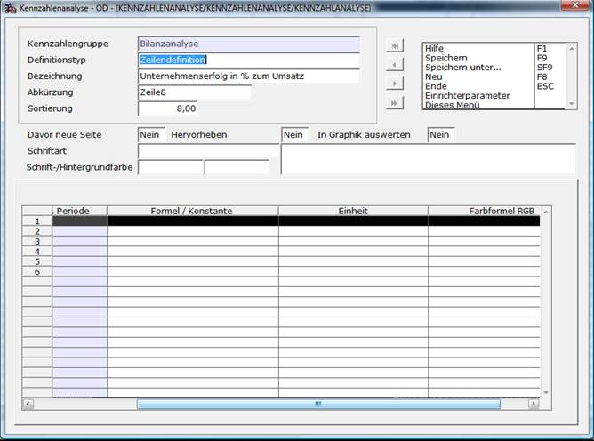

# Zeilendefinition

<!-- source: https://amic.de/hilfe/zeilendefinition.htm -->

Hauptmenü > Abschlussarbeiten > Chefcockpit > Chefcockpit-Designer > Definitionstyp **Zeilendefinition**

Direktsprung **[CCD]**

In der Zeilendefinition wird auf Grundlage der Spaltendefinition der Inhalt der Zelle festgelegt. Die Spaltendefinition wird vorgegeben, so dass man nur noch für die einzelnen Spalten die Werte eintragen muss.

Die Eingabefelder **Davor neue Seite**, **Zeile hervorheben** und **In Graphik auswerten** sowie **Schriftart** und **Schrift-/Hintergrundfarbe** dienen zur optischen Abgrenzung im mitgelieferten Crystal Report (siehe auch Dokumentation [Überschriftzeile](./ueberschriftszeile.md)).

**Konstante**

Als Konstanten sind nur numerische Werte zugelassen. Diese werden mit vier Nachkommastellen gespeichert. Die Standard-Auswertung ist so gebaut, dass alle Werte mit zwei Nachkommastellen ausgegeben werden  
    

**Formel**

Der in den Formeln verwendetet Syntax entspricht dem SQL-Syntax. Im Prinzip wir nichts weiter gemacht als

Set Ergebnis =( **FORMEL** )

Innerhalb der Formel kann man auf Kontenlisten und Ergebnisse aus anderen Formeln zugreifen. Dazu verwendet man die Abkürzung mit einem ‚#‘ vorneweg. Bei den Formelergebnissen ist darauf zu achten, dass die Formeln in der Reihenfolge der Sortierung ausgewertet werden und auch erst dann zur Verfügung stehen. Auf dem Formelfeld kann man mit **F3** sich die Kürzel heraussuchen. Sie werden dann an der Stelle, an dem die Schreibmarke gerade steht, eingefügt.

Wie würde man nun z.B. die Umsatzrentabilität, die sich aus *Betriebsergebnis \*100 / Gesamtleistung* ergibt, als Formel schreiben? Man erstellt sich zwei Kontendefinition BERG für Betriebsergebnis und GL für Gesamtleistung. Die Formel sieht dann wie folgt aus<em>: #BERG \* 100 / #GL</em>

Es ist auch möglich, innerhalb einer Formel auf Spaltenergebnisse derselben Zeile zuzugreifen. Dies ist z.B. dann nötig, wenn man eine prozentuelle Abweichung errechnen möchte. Es steht dafür eine Funktion KZA_GET(Spaltennummer) zur Verfügung. Die Spaltennummer beginnt bei 1. Zu beachten ist grundsätzlich, dass die Spalten von links nach rechts abgearbeitet werden und nur die Spalten „links“ von der aktuellen Spalte als Wert zur Verfügung stehen.

Die Fragestellung „Wie viel Prozent ist Spalte 1 im Verhältnis zu Spalte 2“ errechnet man mit: *KZA_GET(1)\*KZA_GET(2)/100.*

Die Spalte mit der Überschrift **Einheit** ermöglicht es anzugeben, welche Einheit dieser Wert ist. Einheit kann dabei z.B. die Währung aus dem Währungsstamm, ein Festtext wie z.B. ‚%‘ (Achtung: Festtext muss in Hochkomma stehen) oder auch eine Mengeneinheit sein. Wenn man auf Tabellen zugreift, so kann man entweder einfache Select-Anweisung definieren oder auf Datenbankfunktionen zugreifen. Die Syntax entspricht dabei der SQL-Syntax. Das Prinzip ist schon von der Formel bekannt:

Set Ergebnis=( **Einheit** )

In den Reporten und Auswertungen wird die Einheit mit maximal 40 Stellen rechts vom Wert ausgegeben, jedoch sollt man wegen der Übersichtlichkeit kürzere Bezeichnungen wählen.

Die **Farbformel** dient dazu einzelne Zellen im Crytsal Report farblich hervorzuheben. Der Syntax ist an SQL angelehnt. Es können hier private Funktionen oder auch eine IF-Anweisungen formuliert werden. Der resultierende Wert muss vom Typ Character sein. Dieser String kann dann die Zeichenfolgen **FG(R/G/B)** für die Vordergrundfarbe, **BG(R/G/B)** für die Hintergrundfarbe sowie die Schlüsselwörter **FETT** und **KURSIV** enthalten. Diese Zeichenfolgen können beliebig kombiniert werden,

 Es kann mit den Funktionen KZA_GET auf die einzelnen Spaltenergebnisse zugegriffen werden. Es ist darauf zu achten, dass mit KZA_GET nur auf die Spalten links von der aktuellen Spalte und auch auf die aktuelle Spalte zugegriffen werden kann.

Beispiele (**ACHTUNG**: *die Hochkomma beachten!*):

  <table>
    <tbody>
      <tr>
        <td colspan="2">
          
If KZA_GET(1) &lt; 0 then ‘BG(255/0/0),FETT’ endif

        </td>
      </tr>
      <tr>
        <td>
          
⇨

        </td>
        <td>
          
Ist der Wert der ersten Zelle kleiner als 0 dann soll die Hintergrundfarbe rot sein und die Schrift fett dargestellt werden

        </td>
      </tr>
      <tr>
        <td colspan="2">
          
If KZA_GET(2)&gt;KZA_GET(1) then ‘FG(255/0/0)’ else if KZA_GET(2)=0 then ‘FETT,KURSIV’ endif endif

        </td>
      </tr>
      <tr>
        <td>
          
⇨

        </td>
        <td>
          
Ist der Wert der zweiten Zelle größer als der der ersten, dann soll die Vordergrundfarbe rot sein. Sonst soll geprüft werden ob die zweite Zelle gleich 0 ist und die Schrift fett und kursiv dargestellt werden.

        </td>
      </tr>
      <tr>
        <td colspan="2">
          
If MeineBerechnungsfunktion()&gt;0 then ‘FG(255/255/255),BG(0,0,0),FETT‘ endif

        </td>
      </tr>
      <tr>
        <td>
          
⇨

        </td>
        <td>
          
Ist die Berechnung &gt;0 dann wird der Vordergrund weiß und der Hintergrund schwarz dargestellt. Die Schrift ist fett.

        </td>
      </tr>
      <tr>
        <td colspan="2">
          
Farbstaffel(KZA_GET(1))

        </td>
      </tr>
      <tr>
        <td>
          
⇨

        </td>
        <td>
          
Die Funktion Farbstaffel kann je nach Wert einen Farbwert in der obigen Syntax zurück liefern.

        </td>
      </tr>
    </tbody>
  </table>

