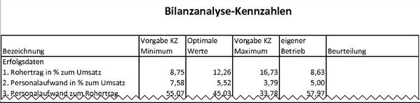
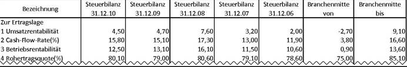

# Chefcockpit / Kennzahlenanalyse

<!-- source: https://amic.de/hilfe/chefcockpitkennzahlenanalyse.htm -->

Kennzahlen werden eingesetzt, um Geschäftsprozesse messbar und damit verbesserungsfähig zu machen. Sie dienen zur Beurteilung von Unternehmen sowie der Festlegung von Unternehmenszielen.

In A.eins kann man sich über ein Kennzahlensystem sogenannte Chefcockpitauswertungen definieren, die anhand der in A.eins existierenden Daten die Kennzahlen errechnen und in Spalten mit Vorjahres- oder Periodenvergleich oder mit konstanten Vergleichszahlen ausgeben. Es ist möglich sich Chefcockpitauswertungen wie

oder

zu definieren. Bei der Definition müssen zuerst die Spalten definiert, anschließend die Kontenlisten bzw. die externen Kontenlisten und am Ende die Zeilen.

Siehe auch:

- [Definition des Chefcockpits](./definition_des_chefcockpits/index.md)
