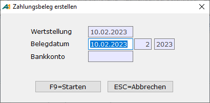

# Zahlungsbeleg erstellen (Buchen)

<!-- source: https://amic.de/hilfe/zahlungsbelegerstellenbuchen.htm -->

Hauptmenü > Mahn-/Zahl-/Zinswesen > Zahlungsverkehr > e-Clearing > Funktion ***Übernahme in Primanota* F8**

Direktsprung **[ECL]**

Zum Buchen zugelassen werden nur Daten, die noch nicht gebucht wurden und bei denen in sämtlichen Positionen Konten eingetragen wurden. Sollten bei den Konten auch Sachkonten hinterlegt sein, wird direkt vor dem Buchen geprüft, ob zu allen Konten, bei denen eine Kostenstelle Pflicht ist, auch eine eingetragen ist. Ansonsten wird eine Liste mit Fehlern ausgegeben und der Beleg kann nicht gebucht werden.  
Sollte man mit Kostenträgern arbeiten, werden auch die im Sachkontenstamm hinterlegten Kostenträger auf diese Weise geprüft. Einträge, bei denen der Kostenträger Pflicht ist und kein Kostenträger angegeben ist, führen zum Fehler. Der Beleg kann dann nicht gebucht werden. Dies gilt genauso für [Kostenobjekte](../kostenrechnung/kostenobjekte/index.md).

Weiterhin wird bei Sachkonten die hinterlegte Steuerinformation ausgewertet und gegebenenfalls eine Steuerposition erzeugt. Steuerpositionen werden gerafft dargestellt, d.h. wenn mehrere Positionen mit demselben Steuersatz existieren, so wird nur eine Summenzeile erzeugt. Diese hat dann als Text „Sammelposition e-Clearing(nnn/nnn) Auszug nnn vom nnn“. Der Betrag wird immer Brutto interpretiert und es wird dementsprechend auch der Steuersatz für Bruttobuchungen herangezogen (also Steuerklasse 2 oder Steuerklasse 102). Fehlerhafte Stammdaten - fehlender Steuersatz bzw. fehlendes Steuerkonto – führen dazu, dass der Beleg nicht gebucht werden kann. Es wird ein Fehlerhinweis ausgegeben.

Beim Erstellen von Zahlungsdienstleister-Zahlungsbelegen werden die Gebühren des Zahlungsdienstleisters auf das ihm hinterlegte [Gebührenkonto](./optionen.md#Zahldienstl_Gebührenkonto) gebucht. Wurde dem Zahlungsdienstleister kein Gebührenkonto zugeordnet, so werden die Gebühren nicht gebucht. Abhängig von der Option „[Gebühren des Zahlungsdienstleisters als Summe buchen](./optionen.md#Zahlungdienstleister)“ wird entweder eine einzelne Gebührenposition erzeugt oder es wird pro Gebühr eine Gebührenposition erstellt.

Angezeigt wird das Wertstellungsdatum, das Bankkonto sowie die Buchungsperiode bzw. das Buchungsjahr. Das Belegdatum wird mit dem Erstelldatum vorbelegt und abgefragt. Jahr und Periode werden anhand dieses Datums aus dem Periodenstamm bestimmt.  
Wie der Nummernkreis behandelt wird, kann unter [Optionen](./optionen.md) **F10** voreingestellt werden. Je nach Einstellung unter Optionen wird der Nummernkreis aus der Hausbank, aus Optionen oder der unter NKF eingetragene Nummernkreis für automatische Zahlungen verwendet.

Sind die Belege erstellt worden, können sie in der Primanota kontrolliert werden. Falls diese Belege nicht korrekt sind und dort vor dem Buchen wieder gelöscht werden, wird auch das Buchungskennzeichen der Zahlungsbelege im Modul e-Clearing zurückgesetzt.  
**  
Achtung:**

Auszifferungsvorschläge für diesen Beleg sind dann nicht mehr vorhanden, da diese mit dem OP gelöscht wurden. Sie können aber jederzeit wieder mit der Automatikerkennung erzeugt werden.
