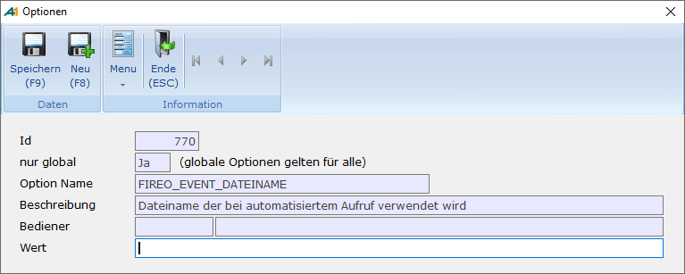

# Automation

<!-- source: https://amic.de/hilfe/automation.htm -->

Um sicher zu stellen, dass man sofort auf eventuell aufgetretene Fehler hingewiesen wird, kann man A.eins so starten, dass sofort der Reorganisator aufgerufen wird und die Testfunktionen ausgeführt werden. Das automatische Ausführen der Reorganisation selbst wird nicht unterstützt.

A.eins muss mit folgender Syntax gestartet werden:

```text
Aeins welcome section DIR=FIREO USER=???? PASSWORT=????
```

A.eins wird gestartet und der Direktsprung FIREO wird direkt ausgeführt. Es werden dann der „***Test Stammdaten***“ und der „***Test Bewegungsdaten***“ ausgeführt. Anschließend wird A.eins verlassen. Das Ergebnis der Tests befindet sich in der Datei, die unter OPT unter der globalen Option FIREO_EVENT_DATEINAME eingetragen ist.



Ist diese Option nicht gesetzt dann wird der Dateiname verwendet, der unter [Optionen](../e_clearing/optionen.md) für den Benutzer eingetragen ist, mit dem A.eins gestartet wird. Wird die Reorganisation als Event gestartet ist zu beachten, dass das Event auf dem Datenbankserver läuft und dort Laufwerk und Pfad existieren müssen. Ist kein Dateiname eingetragen, wird ein Eintrag ins Fehlerprotokoll geschrieben und die Tests werden nicht ausgeführt.

Man kann A.eins auch mit einem weiteren Parameter anweisen, spezielle Test auszuführen:

```text
Aeins welcome section DIR=FIREO USER=???? PASSWORT=???? FIREO=“STAMMDATEN,BEWEGUNGSDATEN,JAHRESWECHSEL BK, …“
```

Es sind folgende Schlüsselwörter vergeben:

- Stammdaten
- Bewegungsdaten
- Jahreswechsel PK
- Jahreswechsel BK
- Zinssaldo
- Waehrung ( Achtung: Währung nicht mit Umlaut )
- Fragmente

Diese Schlüsselwörter können beliebig kombiniert werden. So würde die Kombination FIREO=“Bewegungsdaten,Waehrung“ den „Test Bewegungsdaten“ und den „Test Währung“ durchführen.

Diese Tests können im Windows-Aufgabenplaner eingebunden werden oder als [Event](../../zusatzprogramme/events/fireo.md) (Direktsprung [EVT]).
