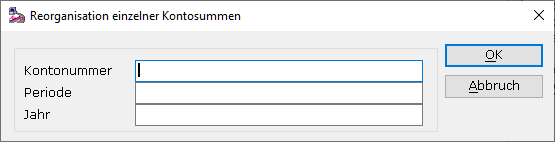

# Einzelkontosummen

<!-- source: https://amic.de/hilfe/einzelkontosummen.htm -->

Hauptmenü > Abschlussarbeiten > Reorganisation > Fibureorganisation > Funktion ***Reorg. Oberkonten***

Direktsprung **[FIREO]**

Der letzte Punkt der Reorganisation **Einzelkontosummen** ermöglicht es Ihnen, für ein einzelnes Konto (bis auf alle Forderungs- und Verbindlichkeitskonten) die Kontosummen für eine Periode in einem Jahr zu reorganisieren. Dies kann sinnvoll sein, wenn Sie bereits einen Test Bewegungsdaten durchgeführt haben und nur ein oder zwei Konten Fehler beim Test der Kontosummen aufgewiesen haben. So muss nicht der gesamte Reorganisationslauf durchgeführt werden. Forderungskonten können hier nicht reorganisiert werden.

