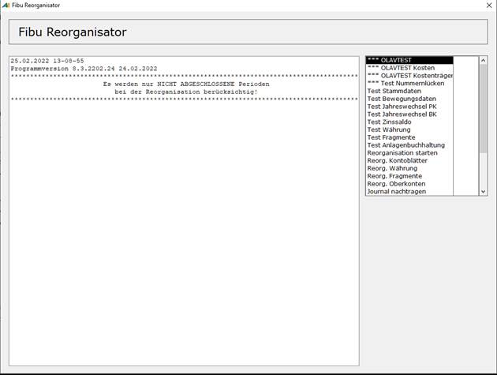

# Fibu Reorganisator allgemein

<!-- source: https://amic.de/hilfe/fibureorganisatorallgemein.htm -->

Um sicher zu stellen, dass man sofort auf eventuell aufgetretene Fehler hingewiesen wird, kann man A.eins so starten, dass sofort der Reorganisator aufgerufen wird und die Testfunktionen ausgeführt werden. Das automatische Ausführen der Reorganisation selber wird nicht unterstützt.

A.eins muss mit folgender Syntax gestartet werden:

Der Fibu Reorganisator ist ein Hilfsprogramm, mit dessen Hilfe Sie Probleme innerhalb Ihrer Datenbestände aufdecken können. Hierfür stehen Ihnen diverse Optionen und Menüpunkte zu Verfügung.

Bei allen Tests gibt es zwei mögliche Überschriften, die Sie darauf hinweisen, wie kritisch dieser Fehler ist.

**\*\*\*\*\*\*\*\*\*\*\*\*\*\*\*\*\*\*\*\*\*\*\*\* A C H T U N G \*\*\*\*\*\*\*\*\*\*\*\*\*\*\*\*\*\*\*\*\*\*\***  
Dies ist eine Meldung, dass etwas in Ihrem System nicht in Ordnung ist, sich aber ohne Komplikationen beheben lässt, oder eventuell nur als Hinweis verstanden werden soll.

**\*\*\*\*\*\*\*\*\*\*\*\*\*\*\*\*\*\*\*\*\*\*\*\*\* F E H L E R \*\*\*\*\*\*\*\*\*\*\*\*\*\*\*\*\*\*\*\*\*\*\*\***  
Hierbei handelt es sich um Fehler, die schnell behoben werden sollten, damit es beim Weiterarbeiten keine unnötigen weiteren Folgefehler gibt.
