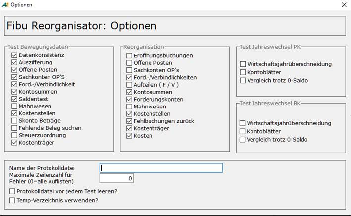

# Optionen des Fibu-Reorganisators

<!-- source: https://amic.de/hilfe/optionendesfibureorganisators.htm -->

Hauptmenü > Abschlussarbeiten > Reorganisation > Fibureorganisation > Funktion ***Optionen* F10**

Direktsprung **[FIREO]**

In den Optionen lassen sich für den [Test der Bewegungsdaten](./test_bewegungsdaten.md) , die [Reorganisation der Bewegungsdaten](./test_anlagenbuchhaltung.md) bzw. für den [Test Jahreswechsel](./test_jahreswechsel.md) einzelne Punkte an und ausschalten.

Die Voreinstellung der Haken für Test Bewegungsdaten und Reorganisation ist fest vorgegeben und wird **nicht** gespeichert. Die Voreinstellung für Kostenstellen und Kostenträger richtet sich danach, ob die Steuerungsparameter (Direktsprung **[SPA]**) „**Kostenstellenrechnung angeschlossen**“ bzw. „**Kostenträgerrechnung angeschlossen**“ auf **Ja** stehen oder nicht.

Die Einstellungen für die Optionen „Test Jahreswechsel …“, der Name und das Verzeichnis der Protokolldatei, in die alle Auswertungsergebnisse geschrieben werden, sowie die Einstellung, ob diese Datei vor jedem Test gelöscht werden sollen, werden pro Benutzer in der Datenbank hinterlegt und somit jedes Mal wieder vorgeschlagen. Wenn man bei „Temp-Verzeichnis verwenden?“ den Haken setzt, dann wird bei jedem Start vom Reorganisator das TEMP-Verzeichnis neu bestimmt.
