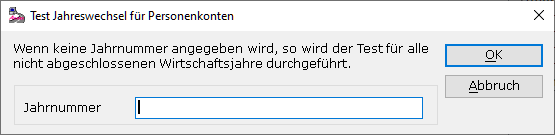

# Test Jahreswechsel

<!-- source: https://amic.de/hilfe/testjahreswechsel.htm -->

Hauptmenü > Abschlussarbeiten > Reorganisation > Fibureorganisation > Funktion ***Test Jahreswechsel***

Direktsprung **[FIREO]**

Der Jahreswechsel in der Finanzbuchhaltung A.eins kann jederzeit, auch wenn alle Perioden des abzuschließenden Jahres noch offen sind, durchgeführt werden und auch jederzeit wiederholt werden. Außerdem steht es ihnen offen, den Jahreswechsel auch manuell durchzuführen. Dies birgt natürlich die Gefahr, dass beim Jahreswechsel Fehler auftreten könnten. Die Menüpunkte ***Test Jahreswechsel PK*** (Personenkonten) und ***Test Jahreswechsel BK*** (Bilanzkonten) prüfen, ob ein Wirtschaftsjahr für den entsprechenden Kontenbereich korrekt abgeschlossen ist und weist Sie auf Fehler oder Auffälligkeiten hin. Sie werden bei der Auswahl aufgefordert, eine Jahreszahl einzugeben. Wenn Sie einfach bestätigen, ohne die Jahreszahl einzugeben, können für alle Wirtschaftsjahre Tests durchgeführt werden.

**Teste Buchungsstatus**

Sind alle Belege im abzuschließenden Jahr schon gebucht? Wenn nein, werden Sie aufgefordert, in den entsprechenden Perioden die Buchungen nachzuholen.

**Teste Summen**

Nach einem ordnungsgemäßen Jahreswechsel muss die Summe aller Konten von Eröffnungs- bis Abschlussperiode Null ergeben. Ansonsten kann man davon ausgehen, dass noch neue Belege hinzugekommen sind, nachdem der Jahreswechsel durchgeführt worden ist. Führen Sie den Jahreswechsel erneut durch.

**Vergleiche Abschluss mit Eröffnung**

Abschlussbuchungen und Eröffnungsbuchungen müssen betragsmäßig gleich hoch sein. Unter Optionen kann eingestellt werden, ob man nur die Konten prüfen will, deren Saldo im Vorjahr ungleich 0 ist. Dann darf bei „**Vergleich trotz 0-Saldo**“ kein Haken gesetzt sein.  
Treten hier Differenzen auf, müssen evtl. entsprechende manuelle Buchungen nachgeholt werden.

**Wirtschaftsjahrüberschneidung**

Belege können über die Periode oder das Belegdatum einem Wirtschaftsjahr zugeordnet werden. Im Allgemeinen sollte das Belegdatum im Bereich der Periode liegen, der dieser Beleg zugeordnet wurde. Ist dies nicht der Fall, kann es zu Problemen kommen, wenn man Listen miteinander vergleichen will, die auf der einen Seite die Eingrenzung über die Perioden vornehmen und auf der anderen über das Belegdatum. Es werden zwei Tests durchgeführt:

    
1\. Liegt das Belegdatum im zu testenden Jahr, die Periode jedoch nicht?

2\. Liegt die Periode im zu testenden Jahr, das Belegdatum jedoch nicht?  
    

Diese Tests lassen sich über Optionen abschalten.

**Teste Jahreswechselkonten (Nur bei Bilanzkonten)**

Hier wird eine Liste aller Konten ausgegeben, die nicht vollständig in den Kontenblättern ausgewiesen werden. Dieser Test lässt sich über Optionen abschalten.

**Teste Jahreswechselkonten (Nur bei Bilanzkonten)**

Hier wird geprüft, ob die Summe der Jahreswechselkonten 0 ergibt. Dies muss der Fall sein, wenn die Umbuchung des G&V Ergebnisses auf ein Bilanzkonto erfolgt ist. Ist dies nicht der Fall, steht hier dieselbe Zahl wie unter der Bilanz bzw. unter der G&V. Wurde bereits umgebucht und sind dann noch nachträglich noch neue Belege hinzugekommen, findet sich hier dies noch zu buchende Differenz.
