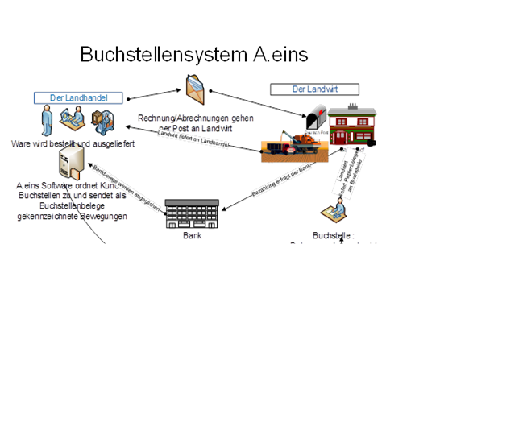

# Buchstellen

<!-- source: https://amic.de/hilfe/buchstellen.htm -->

Das Buchstellenexportsystem unterstützt die Möglichkeit, Bewegungsdaten von Personenkonten an eine übergeordnete Stelle zur Verarbeitung weiter zu leiten.

Es werden hierbei warenwirtschaftliche wie auch finanztechnische Belege des Personenkontos verarbeitet, wobei jeweils in einer privaten Einrichtung festgelegt werden kann ob und welche Belege mit berücksichtigt werden sollen.

Die Verarbeitung ist an bestimmte Kennzeichen im Kundenstamm gebunden, und wird nur auf Wunsch angestoßen.

Alle Buchstellenexportobjekte werden direkt nach der Erzeugung an ein Buchstellenrelaissystem abgegeben, dieser Vorgang läuft vollständig automatisch ab, und wird über einen Webservice abgewickelt. Eine Internetverbindung ist hierzu aber notwendig.

Im A.eins System kann beim Kunden hinterlegt werden, unter welcher Buchstelle der Kunde geführt wird (siehe dazu Kundenstamm). Im zugehörigen Buchstellenstamm kann pro Buchstelle eingestellt werden, ob ein Buchstellenexport erfolgen soll und welche Exportparameter hierfür gelten.

Ist einmal eine Buchstelle im Kundenstamm hinterlegt, so wird für diesen Kunden der gesamte Belegverkehr an die Buchstelle abgewickelt, sofern die Buchstellenabarbeitungsmechanik aktiv ist.

Die Buchstellenbelege werden vom System aus in eine XML – Struktur eingebettet, um dann sofort nach Fertigstellung im Dateisystem abgelegt wird. Von dort aus können die Dateien dann einzeln oder gesammelt z.B. per FTP an die Buchstelle übertragen.

Siehe auch:

- [Einrichtung Buchstellen](./einrichtung_buchstellen.md)
- [Export und Verarbeitung](./export_und_verarbeitung.md)
- [XML-Struktur](./xml_struktur.md)
