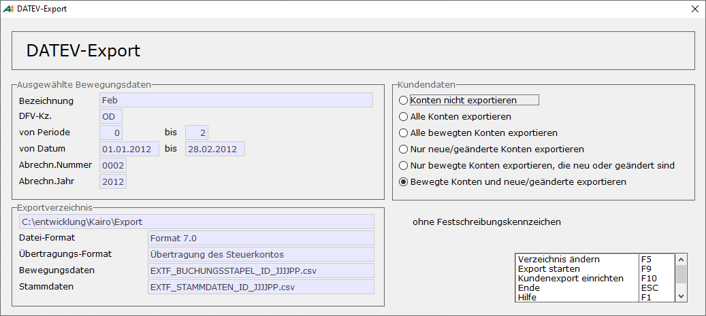

# DATEV-Export bearbeiten

<!-- source: https://amic.de/hilfe/datevexportbearbeiten.htm -->

Hauptmenü > Abschlussarbeiten > DATEV / Import / Export > Datev-Export bearbeiten

Direktsprung **[DATEV]**

Hier stehen Funktionalitäten zur Verfügung:

***Ansehen***: Eine Auswahlliste mit allen in der DATEV-Datei enthaltener Belege wird geöffnet. Diese könnte z.B. als zusätzliches Protokoll verwendet werden.

***Löschen***: Es wird der Datensatz gelöscht und die in dem Export enthaltenen Belege werden wieder als nicht in die DATEV exportiert gekennzeichnet. Wurden die Daten bereits zum Steuerberater gesandt, bleibt ein Vermerk bestehen, dass dieser Satz gelöscht wurde. Auch hier werden die Daten als nicht übertragen gekennzeichnet, so dass die Belege beim nächsten Erstellen wieder mit herangezogen werden.

***Datei erstellen***: hier befindet sich die Funktion, die die Daten in die Datei schreibt. Wird ein Datensatz ausgewählt, der bereits übertragen wurde, wird man darauf hingewiesen. Bevor die Datei erstellt wird, wird bei Übermittlung der Steuer über den DATEV-Steuerschlüssel noch geprüft, ob bei den verwendeten Steuersätzen ein gültiger DATEV-Steuerschlüssel eingetragen ist.

 

Wenn der SPA „[DATEV Festschreibungskennzeichen](./besonderheiten.md#DATEVFestschreibung)“ auf „Ohne Festschreibungskennzeichen“ steht, wird dies über der Optionbox angezeigt.

Zusätzlich zum Export der Bewegungsdaten ist ein Export der Kundendaten möglich. Wie und ob sie exportiert werden sollen, wird hier eingestellt. Welche Daten über die Schnittstelle übermittelt werden sollen, kann individuell [definiert](./datev_kundenexport_einrichten.md) werden. Werden zu den Bewegungsdaten auch Kundendaten exportiert, wird eine weitere Datei geschrieben. Es müssen immer alle Dateien dem Steuerberater übermittelt werden.

Zu dem Export existieren diverse Einrichtungsparameter:

DATEV-Steuerschlüssel in Textfeld mit übergeben?  
Steht dieser Parameter auf **Ja** wird vor den Text im Beleg die Nummer des DATEV-Steuerschlüssels geschrieben. Dieser muss für diesen Fall im Steuersatz hinterlegt sein.  
    

Bei Eingangsrechnungen Referenznummer übergeben?  
Mit diesem Parameter wird das Programm angewiesen bei Eingangsrechnungen/Eingangsgutschriften anstelle der Belegnummer die Referenznummer zu übergeben.  
    

Bei diversen Kunden Adresse als Text übergeben?  
Um es dem Steuerberater zu ermöglichen, bei diversen Kunden eine Unterscheidung vorzunehmen, kann man hier festlegen, dass anstelle des Textes die Adresse des Kunden übergeben wird. Im Standard wird das Feld „Adressbezeich“ aus der Tabelle Anschriftstamm übergeben.  
    

Adressfelder für die Adressausgabe bei diversen Kunden  
Wenn man die Adressausgabe bei diversen Kunden anders gestalten möchte, kann man hier Felder aus der Tabelle Anschriftstamm auswählen. Die verschiedenen Felder können mit &#124;&#124; verknüpft werden. Beispiel:  
    
AdressName&#124;&#124;‘/‘&#124;&#124;AdressOrt  
    
**Achtung:**  
*Von Seiten der Datev ist der Text auf 30 Zeichen beschränkt.  
*  

Auszifferungsinformation mit übertragen?  
Es gibt die Möglichkeit Auszifferungsinformationen an die DATEV-Anwendung OPOS mit zu übergeben. Dabei werden bei Zahlungsbelegen (Belegarten ZA, ZB und SE) als Rechnungsnummer die Rechnungsnummer der bezahlten Rechnungen übergeben und im Belegfeld2 die Belegnummer des Zahlungsbeleges. Da die DATEV nicht für alle in A.eins möglichen Verrechnungsarten (z.B. Bildung von Restposten) Strukturen anbietet, kann die Information nicht in jedem Fall vollständig sein.  
    
**Achtung:**  
*Wenn man im DATEV-Firmenstamm angegeben hat, dass man für Personenkonten mit* [*Ersatzkontonummern aus der Forderungsgruppe*](./datev_firmenstamm.md#DatevErsatzkontonummer) *arbeiten will, so werden diese Informationen **nicht** mit übertragen.*  

Automatikaufhebung unterdrücken?  
Bei der DATEV existieren so genannte „[Automatikkonten](./besonderheiten.md#Datevautomatik)“, für die die Steuer nicht in die Schnittstelle mit übergeben werden darf, sondern selbstständig vom DATEV-Programm errechnet wird. Für den Fall, dass in einem Beleg als Steuerbetrag 0,00 eingetragen ist, wird diese Automatik von A.eins unterdrückt. Diese Aufhebung der Automatik lässt sich mit diesem Einrichterparameter abschalten.  
    

Ab diesem Jahr Sachkontennummer \* 10 (nur KNE)  
**Sonderentwicklung:** *NICHT VERWENDEN!  
*  

Text immer aus der Position des Personenkontos.  
Der an die DATEV übergebene Text wird im Normalfall aus der Position des Erlösskontos gezogen. Setzt man diesen Parameter auf **Ja**, so wird, soweit ein Personenkonto in diesem Beleg existiert der Text aus dieser Position übertragen. Dies kann hilfreich sein, falls vom Steuerberater auch die Mahnungen erstellt werden.  
    

FiBuV_Nummer an Stelle der FiBuV_NumNummer übermitteln (alle Formate außer OBE)  
Bisher wurde immer nur die numerische Belegnummer an die DATEV übergeben. Im Format OBE darf die Belegnummer nach wie vor nur 6-stellig und numerisch sein, alle anderen Formate lassen alphanumerische Belegnummern zu, die bis zu 12 Stellen haben dürfen.  
    

Vertretergruppe im Feld Kostenstelle 2 übermitteln  
Steht hier ein **Ja**, so wird im Feld Kostenstelle 2, welches im Standard die Kostenträgernummer enthält die Vertretergruppe die den Warenwirtschaftsbelegen eingetragen wurde, übermittelt.
