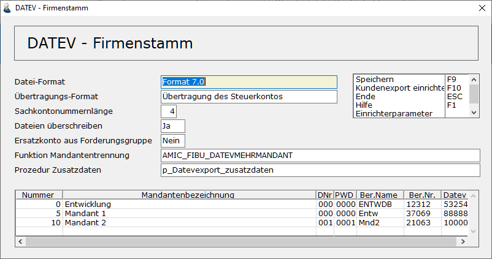

# DATEV-Firmenstamm

<!-- source: https://amic.de/hilfe/datevfirmenstamm.htm -->

Hauptmenü > Abschlussarbeiten > DATEV / Import / Export > DATEV Firmenstamm

Hier werden einmalig Daten erfasst, die für die Erkennung der Datei erforderlich sind.

  <table>
    <tbody>
      <tr>
        <td>
          
<strong>Feldname</strong>

        </td>
        <td>
          
<strong>Beschreibung</strong>

        </td>
      </tr>
      <tr>
        <td>
          
Datei-Format

        </td>
        <td>
          
Es stehen drei Dateiformate zur Verfügung

          
<u>(OBE) Ordnungsbegriffserweiterung</u> Es gelten für dieses Format folgende Einschränkungen:

          
Referenznummern dürfen nur Numerisch sein.

          
Belegnummer/Referenznummer darf nur maximal 6 Stellen haben.

          
Kostenstellennummer darf maximal 4 Stellen haben

          
Sachkonten dürfen nur 4 Stellen und Personenkonten nur 5 Stellen haben. Der Bereich der Debitoren ist auf 10000 bis 69999 und der der Kreditoren auf 70000 bis 99999 festgelegt.

          
(KNE) Kontonummernerweiterung.

          
Das Format KNE ist seit 08.2000 gültig. Es kann nur von den aktuellen DATEV-Windows-Programmen mit Schnittstelle importiert werden. Es ist hier eine Absprache mit dem Steuerberater notwendig. Dieses Format unterscheidet sich in folgenden Punkten von dem Aufzeichnungsverfahren OBE:

          
Referenznummern können auch Alphanumerisch sein.

          
Belegnummer/Referenznummer können bis zu 12 Stellen haben.

          
Umsatz kann statt 10 Stellen bis zu 12 Stellen (incl. Nachkommastellen) haben.

          
Kostenstellen können bis zu 8 Stellen haben (OBE nur 4).

          
Sachkonten können bis zu 8 Stellen haben. Hier gelten die von der DATEV vorgegebenen Regeln (Nummer der Personenkonten muss eine Stelle mehr haben als die der Sachkonten)

          
Die Namen der zu übertragenden Dateien werden statt DV01 bzw. DE001/DE002 zu EV01 und ED00001/ED00002.

          
Format 3.0

          
Dieses Format ist seit 2012 gültig und soll die bisherigen Postversandverfahren OBE und KNE ablösen. Zum Jahreswechsel&nbsp; 2017/2018 wurden diese Formate von DATEV abgekündigt.

          
Die Namen der zu übertagenden Dateien lauten:  

          
EXTF_BUCHUNGSSTAPEL_ID_JJJJPP.csv

          
Und

          
EXTF_STAMMDATEN_ID_JJJJPP.csv

          
ID steht für die Datev-Id. Dadurch sind die Dateien immer dem entsprechenden Datenbestand in A.eins zuzuordnen.

          
JJJJ Steht für das beim Export angegebene Wirtschaftsjahr.

          
PP für die „Bis-Periode“.

          
Format 7.0

          
Dies ist eine Weiterentwicklung des Formats 3.0 und seit 2018 gültig.

        </td>
      </tr>
      <tr>
        <td>
          
Übertragungs-Format

        </td>
        <td>
          
Hier kann angegeben werden, ob die Steuerinformation über das Steuerkonto übermittelt wird oder ob nur der DATEV-Steuerschlüssel übermittelt wird und somit auf Seiten der DATEV automatisch der UST-Betrag&nbsp; errechnet und auf das entsprechende Sammelkonto gebucht wird.

        </td>
      </tr>
      <tr>
        <td>
          
Sachkontonummernlänge

        </td>
        <td>
          
Bei den Format 3.0, 7.0 und KNE kann man hier die Länge der Sachkontonummer eintragen. Diese darf zwischen 4 und 8 liegen. Es wird dann automatisch davon ausgegangen, dass die Personenkonten jeweils um eine Stelle länger sind.

        </td>
      </tr>
      <tr>
        <td>
          
Dateien überschreiben

        </td>
        <td>
          
Dieses Feld ist nur für die Formate OBE und KNE aktiv. Ab Format 3.0 werden für verschiedene Exporte immer eigene Dateien geschrieben, da im Dateinamen die DATEV-Id enthalten ist.

          
Hiermit wird gesteuert, ob die Daten die bestehenden Dateien überschreiben sollen oder ob sie angehängt werden. Die Standardeinstellung ist <b>Ja</b>, so dass die Dateien immer ohne Prüfung neu erstellt werden. Stellt man hier <b>Nein</b> ein, so ändert sich das Verhalten etwas. Zum einen werden die Daten an die Dateien angehängt, zum anderen ist es nur noch dann erlaubt die Dateiausgabe zu wiederholen, wenn im Verzeichnis keine Steuerungsdatei (DV01 oder EV01) enthalten ist.

        </td>
      </tr>
      <tr>
        <td>
          
Ersatzkontonummer aus Forderungsgruppe

        </td>
        <td>
          
Wird dieses Feld auf <b>Ja </b>gestellt, so erhält man die Möglichkeit zu <a href="../../../stammdaten_der_fibu/forderungsgruppen.md">Forderungsgruppen</a> (Direktsprung <strong>[FORG]</strong>) Ersatzkontonummer für Personenkonten zu hinterlegen. Es wird dann beim DATEV-Übertrag an Stelle der Personenkontonummer aus dem Beleg die in der Forderungsgruppe hinterlegte Personenkontonummer verwendet. D.h. es wird lediglich ein Konto pro Forderungsgruppe übertragen. Dies dient lediglich dem Zweck, den DATEV-Übertrag zu ermöglichen, obwohl man bei der Einrichtung der Kontonummern nicht bedacht hat, dass DATEV sowohl bei der Länge als auch beim Bereich für Debitoren und Kreditoren Einschränkungen macht.&nbsp; Für dieses Verfahren ergeben sich folgende Einschränkungen:

          
OP-Führung ist auf der DATEV-Seite nicht möglich.

          
Auszifferungsinformationen können nicht an die DATEV übertragen werden.

          
Mahnwesen ist für die DATEV-Seite nicht möglich.

          
Der Übertrag der Stammdaten ( Personenkonten ) macht keinen Sinn mehr.

        </td>
      </tr>
      <tr>
        <td>
          
Funktion Mandantentrennung

        </td>
        <td>
          
Diese Datenbankfunktion dient dazu, zu bestimmen, welcher Beleg zu welchem Mandanten gehört. Ist keine Funktion hinterlegt, wird keine Mandantentrennung vorgenommen. Dies ist die Standardeinstellung. Die Funktion bekommt als Parameter die FiBuV_Id übergeben und muss die Nummer des Mandanten (siehe unten) zurückliefern. Die Funktion könnte wie folgt aussehen:

          

            <pre><code>CREATE Function AMIC_FIBU_DATEVMEHRMANDANT( in in_FiBuV_Id       integer )
returns integer
BEGIN
  declare Ergebnis integer;
  set Ergebnis = (select MandNummer from MandantenZuordnung);
  return Ergebnis;
END</code></pre>
          

        </td>
      </tr>
      <tr>
        <td>
          
Prozedur Zusatzdaten

        </td>
        <td>
          
Diese Funktion wird nur für die Formate 3.0 und 7.0 ausgewertet. Von A.eins werden nur bestimmte Felder aus der Feldbeschreibung des Buchungsstapels verwendet. Gibt man hier eine Prozedur an, so können alle nicht von A.eins verwendeten Felder Individuell belegt werden. Diese Prozedur muss folgenden Aufbau haben:

          

            <pre><code>CREATE PROCEDURE p_DATEVEXPORT_ZUSATZDATEN
  (
    in in_Fibuv_id integer,
    in in_Fibuv_poszaehler integer,
    in in_Fibuvp_buchtyp integer
  )
RESULT (
  fieldNumber       integer,
  StringValue  char(255),
  IntValue     integer,
  DateValue    date,
  NumericValue numeric(15,6)
)
BEGIN
 .
 .
 .
END</code></pre>
          

          
Diese Funktion wird einmal pro ausgegebener Datenzeile aufgerufen und muss je Feld, welches versorgt werden soll, einen Datensatz zurückliefern.

          
Die Feldnummer ist die Feldnummer laut DATEV-Dokumentation des Buchungsstapels In die Felder StringValue, IntValue, DateValue, NumericValue erwartet A.eins je nach Datentyp einen Eintrag. Wir Null als Wert zurückgeliefert, so werden keine Daten ausgegeben.

          
Beispiel, in dem die Zinssperre aus dem Kundenstamm und das KOST-Datum mit dem Tagesdatum versorgt werden soll.

          

            <pre><code>CREATE PROCEDURE p_DATEVEXPORT_ZUSATZDATEN
  (
    in in_Fibuv_id integer,
    in in_Fibuv_poszaehler integer,
    in in_Fibuvp_buchtyp integer
  )
RESULT (
  fieldNumber       integer,
  StringValue  char(255),
  IntValue     integer,
  DateValue    date,
  NumericValue numeric(15,6)
)
BEGIN
  select 19, null, KundZinssperr, null, null
    from kundenstamm k
    join fibuvorgposition p on p.kontonummer=k.kontonummer
    Where p.fibuv_id = in_Fibuv_id and fibuv_poszaehler=1
  union
  select 104, null, null, today(*), null from dummy
END</code></pre>
          

          
Hinweis: Der Parameter in_fibuv_poszaehler ist immer der Zaehler der Zeile mit dem Erlöskonto

          
Von A.eins werden die Felder Typgerecht ausgelesen und auch auf die korrekte Ausgabelänge geprüft. Bei Felder, die zu Lang geliefert werden, wird ein entsprechender Eintrag ins Fehlerprotokoll geschrieben. Die Ausgabe in die Datei erfolgt bei Zahlen jedoch ungekürzt, zu lange Texte werden auf die zulässige Länge gekürzt.

          
Folgende Felder werden von A.eins versorgt und können nicht geändert werden:

          <table>
            <tbody>
              <tr>
                <th><b>Nummer laut DATEV- Dokumentation</b></th>
                <th><b>Bedeutung</b></th>
              </tr>
              <tr>
                <td>1</td>
                <td>Umsatz</td>
              </tr>
              <tr>
                <td>2</td>
                <td>Sollhaben-Kennzeichen</td>
              </tr>
              <tr>
                <td>7</td>
                <td>Konto</td>
              </tr>
              <tr>
                <td>8</td>
                <td>Gegenkonto</td>
              </tr>
              <tr>
                <td>9</td>
                <td>Steuerschlüssel oder Berichtigungsschlüssel</td>
              </tr>
              <tr>
                <td>10</td>
                <td>Belegdatum</td>
              </tr>
              <tr>
                <td>11</td>
                <td>Belegfeld1</td>
              </tr>
              <tr>
                <td>12</td>
                <td>Belegfeld2</td>
              </tr>
              <tr>
                <td>13</td>
                <td>Skonto</td>
              </tr>
              <tr>
                <td>14</td>
                <td>Buchungstext</td>
              </tr>
              <tr>
                <td>40</td>
                <td>EU-Mitgliedstaat u. UStIdNr.</td>
              </tr>
              <tr>
                <td>41</td>
                <td>EG-Steuersatz</td>
              </tr>
              <tr>
                <td>114</td>
                <td>Festschreibungskennzeichen</td>
              </tr>
              <tr>
                <td>118</td>
                <td>Generalumkehr</td>
              </tr>
            </tbody>
          </table>
        </td>
      </tr>
      <tr>
        <td>
          
Nummer / Mandantenbezeichnung

        </td>
        <td>
          
Es ist möglich den Export so zu steuern, dass die Belege auf mehrere Mandanten aufgeteilt werden. Zu diesen Mandanten muss eine eindeutige Nummer und optional eine Mandantenbezeichnung erfasst werden. Über die Mandantennummer werden dann die Belege dem DATEV-Mandanten zugeordnet. Um zu bestimmen, welche Nummer welchem Mandanten zuzuordnen ist, muss man eine Datenbankfunktion anlegen (siehe oben). &nbsp;Beim Erstellen der Datei wird zusätzlich zum angegebenen Pfad ein Unterverzeichnis pro Mandanten angelegt. Dieses Verzeichnis bekommt als Namen die Mandantenbezeichnung.

        </td>
      </tr>
      <tr>
        <td>
          
Datenträger Nr.

        </td>
        <td>
          
Dies ist eine frei wählbare 3stellige Nummer. Wird ab Format 3.0 nicht mehr verwendet.

        </td>
      </tr>
      <tr>
        <td>
          
Passwort, Beratername, Beraternummer und Mandant DATEV

        </td>
        <td>
          
Dies sind Informationen, die man vom Steuerberater erhält. Wenn vom Steuerberater diese Informationen nicht gefordert/geliefert werden, so sind hier Nullen einzutragen. In den Formaten 3.0/7.0 werden die Felder Passwort und Beratername nicht mehr benötigt.

        </td>
      </tr>
    </tbody>
  </table>

