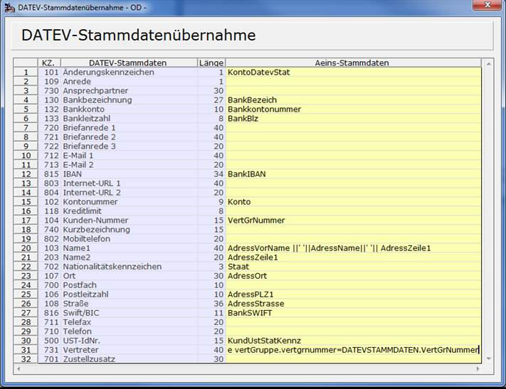

# DATEV-Kundenexport einrichten

<!-- source: https://amic.de/hilfe/datevkundenexporteinrichten.htm -->

Hauptmenü > Abschlussarbeiten > DATEV / Import / Export > DATEV Kundenexport einrichten

Direktsprung **[DATEVK]**

Bei der Übergabe der Stammdaten werden die Daten der Personenkonten an die DATEV übermittelt. Diese können frei eingerichtet werden. Für die Formate OBE und KNE ist die Einrichtung Identisch, für die neueren Formate 3.0 und 7.0 müssen andere Kennziffern zugeordnet werden.



In diesem Pfleger kann man den Kennzahlen der DATEV die Werte aus A.eins zuordnen. Welche Werte aus A.eins zugelassen sind lässt sich in einer F3-Auswahl auswählen. Die Werte für die Kennzahl 101 „Änderungskennzeichen“ und 102 „Kontonummer“ für die Formate OBE und KNE sind Pflichtangaben und lassen sich nicht ändern. Für das Format 3.0/7.0 ist nur das Konto Pflicht. Alle anderen Angaben sind Optional.

Bei der Zuweisung der Felder kann man auch mehrere Felder miteinander verbinden (siehe Kennziffer 103 „Name1“) oder Datenbankfunktionen einbinden. Auch Subselects wie unter Kennziffer 731 „Vertreter“ sind möglich. Die komplette Zeile lautet in diesem Beispiel:

```sql
select VertGrBezeich from VertGruppe where vertGruppe.vertgrnummer=DATEVSTAMMDATEN.VertGrNummer
```

Der Syntax entspricht dem SQL-Syntax. Um sicher zu stellen, dass nicht erst beim Export ein Syntax-Fehler gemeldet wird, wird im Rechte-Maustaste-Menü die Funktion „***Syntax-Test***“ **F6** angeboten. Diese baut das Statement zusammen und führt es einmal aus. Es erscheint ggf. ein Fehlermeldung oder ein Hinweis, dass der Syntax korrekt ist.

Die Funktion „***Standard wiederherstellen***“ **F7** löscht alle Einrichtungen und trägt die einfachen Vorgaben von AMIC wieder ein.
