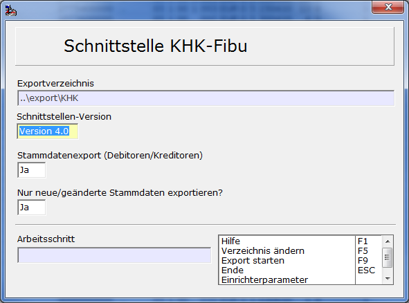
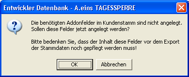
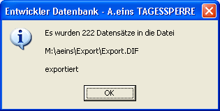

# Export KHK-Finanzbuchhaltung

<!-- source: https://amic.de/hilfe/exportkhkfinanzbuchhaltung.htm -->

Hauptmenü > Abschlussarbeiten > DATEV / Import / Export > Export > Variante Belegexport KHK Finanzbuchhaltung

Direktsprung **[FIEX]**

Dem Export von Belegen aus der A.eins-Finanzbuchhaltung in die KHK-Finanzbuchhaltung liegen vier Datenbankprozeduren zugrunde, die die Daten in der Form bereitstellt, in der sie von der Importschnittstelle der KHK-Finanzbuchhaltung erwartet werden. Dies hat den Vorteil, dass Änderungen kurzfristig nachgearbeitet werden können. Es handelt sich hier um einen Belegexport (also nicht nur OPs) und um einen Export der geänderten bzw. neu angelegten Personenkonten. Beim Belegexport werden alle Belege aus der Warenwirtschaft ( Einkaufsrechnungen, Einkaufsgutschriften, Stornorechnungen, Ausgangsrechnungen, Ausgangsgutschriften, Rohwarenzu- und Abgang), die bereits in die Fibu übertragen und gebucht worden sind in eine Daten „Export.DIF“ geschrieben.

 

Wenn man den Export das erste Mal startet, wird automatisch „..\\export\\khk“ als Verzeichnis für den Export vorgeschlagen. Existiert dieses Verzeichnis nicht, wird es automatisch angelegt. Es kann mit der Funktion <strong><em>Verzeichnis ändern </em>F5</strong><em> </em> geändert werden. Der ausgewählte Pfad wird zwischengespeichert und bei der nächsten Verwendung dieses Programmteils wieder vorgeschlagen.

Die Schnittstelle kann die Daten in der Version 3.2 und 4.0 übertragen. Zusätzlich lässt sich auswählen, ob die Personenkonten mit übertragen werden und ob immer sämtlich Stammdaten oder nur geänderte Stammdaten übertragen werden sollen. Wenn man diesen Export das erste Mal startet sind natürlich alle Personenkonten als noch nicht übertragen gekennzeichnet. Beim nächsten Export werden dann nur die Personenkonten übertragen, die sich seither geändert haben.

Man startet den Export mit **F9**. Vor dem Start des Exports wird vom Programm geprüft, ob die benötigten Addonfelder angelegt wurden. Hierfür existiert in der Auswahlliste eine Funktion <strong><em>Addonfelder anlegen </em>F10</strong><em>. </em>Sind die Felder noch nicht angelegt, bekommt man hier die Möglichkeit, diese Felder anzulegen:

ACHTUNG:

Die Inhalte müssen vor dem Export gepflegt werden! Für den Belegexport wird das Feld Zahlungstyp benötigt, für den Stammdatenexport werden die Felder OPKennzeichen und Steuerschlüssel verwendet.

Wird die Funktion abgebrochen, findet kein Export statt.

Bevor der eigentliche Export gestartet wird, werden eventuell vorhandene Dateien umbenannt. Sie bekommen als zusätzliche Endung die interne Nummer des letzten Exports. Diese Nummer findet man auch in der Relation Fibuvorgstamm und der Relation FibuvorgExport im Feld Fibuv_ExportIdent wieder, um eine Verbindung zwischen Daten und der Datei zu haben.

Nach dem Belegexport werden die exportierten Daten mit einem Merker und einem Eintrag in der Relation FibuvorgExport versehen, damit ein versehentliches doppeltest Exportieren nicht möglich ist. Aufgetretene Fehler werden am Ende in einer Liste angezeigt. Es erscheint am Ende folgende Meldung.

Wenn man im Feld Stammdatenexport ein **Ja** eingetragen hat, werden alle neuen und geänderten Personenkonten übertragen. Sie werden getrennt nach Debitoren und Kreditoren in die Dateien OPDEBIT.DIF bzw. OPCREDIT.DIF geschrieben. Kontokorrentkunden erscheinen in beiden Dateien.

#### Verwendete Prozeduren

Es werden vier Prozeduren verwendet:

**AMIC_FIBU_KHKEXPORT**  
Diese stellt die Daten für Rechnungsausgang mit Kontonummernerweiterung (Satzkennung „RAD31“ oder „RAD40“) und Rechnungseingang mit Kontonummernerweiterung (Satzkennung „REK31“ oder „REK40“) zur Verfügung. Hier werden auch die Kriterien für die Eingrenzung festgelegt. Einzusehen ist die Prozedur unter „SQLP“

**AMIC_FIBU_KHKEXPORTPOSITION**  
Hier werden die Daten für die Erlöse mit Kontonummernerweiterungen (Satzkennung „RAE31“ oder „RAE40“) und Aufwendungen mit Kontonummernerweiterungen (Satzkennung „REE31“ oder „REE40“) bereitgestellt.

**AMIC_FIBU_KHKEXPORTDEBITOR**  
Es werden hier die Daten für Debitoren und Kontokorrentkunden zusammengesucht.

**AMIC_FIBU_KHKEXPORTKREDITOR**  
Es werden hier die Daten für Kreditoren und Kontokorrentkunden zusammengesucht.
