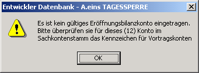
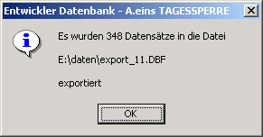

# OP Export für Reimport per DBF-Import

<!-- source: https://amic.de/hilfe/opexportfrreimportperdbfimport.htm -->

Hauptmenü > Abschlussarbeiten > DATEV / Import / Export > Export > Variante OP-Export für Reimport per DBF-Import

Direktsprung **[FIEX]**

Für den Export aus der A.eins Finanzbuchhaltung existiert eine Auswahlliste, in der die OPs bzw. die Belege aufgelistet werden. Bei den von A.eins angebotenen Verfahren wird beim Export die Relation FiBuVorgExport mit den ID‘s aller exportierten Belege gefüllt und bei Erfolg das Feld FiBuV_ExportIdent mit einer ID gefüllt, die auf die entsprechenden Daten in FiBuVorgExport verweist. Diese Auswahlliste für „Reimport per DBF Import“ ist bereits so aufgebaut, dass die Daten in dem Format zur Verfügung stehen, wie sie beim DBF Import in die Standardimportschnittstelle erwartet werden. Als Auswahlkriterium wird lediglich das Eröffnungsbilanzkonto abgefragt. Dies muss ein gültiges Sachkonto sein, bei dem das Kennzeichen Vortragskonto auf **Ja** gesetzt ist. Wählt man hier den Punkt "Export in DBF-Datei" aus, wird das angegebene Konto überprüft. Ist es nicht korrekt, erscheint die Fehlermeldung:

Bei korrekter Eingabe des Kontos werden der Pfad und Dateiname abgefragt. Pfad und Dateiname werden zwischengespeichert und beim nächsten Aufruf wieder vorgeschlagen.  
    
**Achtung:**

Der Dateiname wird zusätzlich mit der Nummer versehen, die im Fibuvorgstamm im Feld FiBuV_ExportIdent hinterlegt wird. Wenn man also EXPORT.DBF als Dateinamen angibt, wird der Name um die Nummer (z.B. 4377) erweitert, so dass der Dateiname EXPORT_4377.DBF lautet.

Nach erfolgreichem Export erscheint folgende Meldung:

