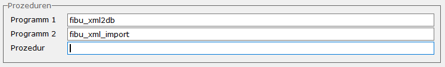

# FIBU-XML-Import

<!-- source: https://amic.de/hilfe/fibuxmlimport.htm -->

Hauptmenü > Abschlussarbeiten > DATEV / Import / Export > Datenübernahme

Direktsprung **[DUEB]**

Der Import von XML-Daten wie sie unter [www.amic.de/schema/finanzbuchhaltung](http://www.amic.de/schema/finanzbuchhaltung) beschrieben sind, kann auch über die [Datenübernahme-Schnittstelle](./index.md) eingespielt werden.

Dazu muss unter „Programm 1“ fibu_xml2db %F eingetragen werden. Diese Funktion prüft, ob der Aufbau des Dokuments den Vorgaben entspricht. Eventuell auftretende Fehler werden anschließend in einem Textdokument ausgegeben. Ist das Dokument formal in Ordnung, werden die Daten in der Tabelle FIBUXMLIMPORT gespeichert, um dort dann weiter verarbeitet zu werden. Zur Prüfung der formalen Richtigkeit gehört auch die Validierung des XML-Dokumentes gegen die Schemadefinition. Ist diese nicht im XML-Dokument selbst angegeben, so kann sie in der Einrichtung unter „Schemalocation“ eingetragen werden. Für das hier verwendete Schema muss sie folgendermaßen lauten:

```text
https://www.amic.de/schema/finanzbuchhaltung/fibu-import-schema.xsd
```

Unter „Programm 2“ muss dann fibu_xml_import eingetragen werden. Die Daten werden hier erst auf Inhaltliche Richtigkeit geprüft (Existieren die Konten? Ist der Steuersatz gültig usw.) und am Ende in einem Textdokument aufgelistet. Nur wenn alle Daten in Ordnung sind, werden die Belege erstellt.



Das Angeben der Prozedur ist hier optional. Wird keine private Prozedur angegeben, dann wird die Standard-Datenbankprozedur von AMIC verwendet. Gibt man hier eine nicht existierende Prozedur an, so wird die AMIC-Datenbankprozedur als Vorlage verwendet und als Template zur Verfügung gestellt.

Ist der Aufbau der zu importierenden Daten fehlerhaft, so ist es nicht notwendig eine neue Datei mit neuer Übertragungsnummer zu generieren, um erneut importiert zu werden. Über die Option „[Fehlerhaften Daten überschreiben?](./index.md#FehlerhafteDatenUeberschreiben)“ kann eingestellt werden, ob die Datei erneut eingespielt werden darf.

Sind nur die Daten fehlerhaft, weil z.B. die Periode nicht offen war oder ein Konto nicht angelegt war, so kann nach Korrektur des Fehlers in der Variante „Datenübernahme wiederholen“ diese Einspielung wiederholt werden. Dort werden die eingespielten Daten mit dem Status „Daten fehlerhaft“ angezeigt und es kann mit der Funktion „Übernahme wiederholen“ das Erstellen der Belege wiederholt werden.
