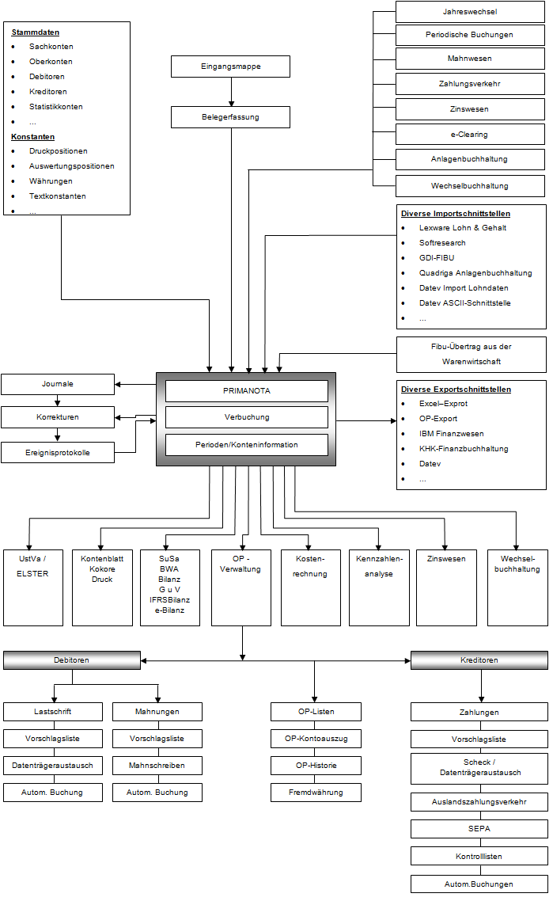

# Finanzbuchhaltung

<!-- source: https://amic.de/hilfe/finanzbuchhaltung21.htm -->

Die Finanzbuchhaltung ist voll integriert in das A.eins - Konzept. Sämtliche Stammdaten, Parameter etc. werden gemeinsam genutzt. Dies trifft auch dann zu, wenn man in der Finanzbuchhaltung im Bereich Stammdaten auf Bereiche wie Kundenstamm u.ä. trifft. Es handelt sich dann nur um Anwahlpunkte für die gleiche Datengrundlage, die zur Arbeitserleichterung hier noch einmal zur Verfügung gestellt wurden. Natürlich verfügt die Finanzbuchhaltung auch über eigenständige Stammdatenbereiche, wie Mahnparameter,Zinsgruppen,… usw.; diese werden dann hier exklusiv gepflegt.

Insgesamt werden derzeit mit der A.eins Finanzbuchhaltung folgende Bereiche abgedeckt:

Siehe auch:

- [Stammdaten der Fibu](./stammdaten_der_fibu/index.md)
- [Belegerfassung](./belegerfassung/index.md)
- [Buchungen Finanzbuchhaltung](./buchungen_finanzbuchhaltung/index.md)
- [Kontoblattdruck](./kontoblattdruck/index.md)
- [Umsatzsteuer](./umsatzsteuer/index.md)
- [eBilanz-Online](./ebilanz_online/index.md)
- [OP-Verwaltung](./op_verwaltung/index.md)
- [Konteninformationen](./konteninformationen/index.md)
- [Währungsbehandlung in der Finanzbuchhaltung](./waehrungsbehandlung_in_der_finanzbuchhaltung/index.md)
- [Mahnwesen](./mahnwesen/index.md)
- [Zahlungsverkehr](./zahlungsverkehr/index.md)
- [e-Clearing](./e_clearing/index.md)
- [Kostenrechnung](./kostenrechnung/index.md)
- [Zinswesen](./zinswesen/index.md)
- [Anlagenbuchhaltung](./anlagenbuchhaltung/index.md)
- [Jahreswechsel](./jahreswechsel/index.md)
- [Wechselbuchhaltung](./wechselbuchhaltung/index.md)
- [Chefcockpit / Kennzahlenanalyse](./chefcockpit_kennzahlenanalyse/index.md)
- [Chefauswertung](./chefauswertung.md)
- [Fibu Reorganisator](./fibu_reorganisator/index.md)
- [Fibu Schnittstellen](./fibu_schnittstellen/index.md)
