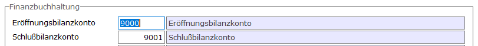
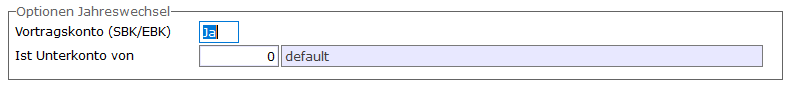
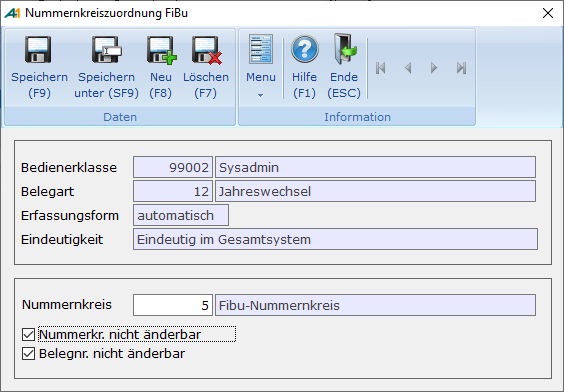

# Stammdaten Jahreswechsel

<!-- source: https://amic.de/hilfe/stammdatenjahreswechsel.htm -->

#### Steuerparameter

Hauptmenü > Administration > Steuerung > Steuerparameter zeigen

Direktsprung **[SPA]**.

Für die [Währungsbehandlung](../waehrungsbehandlung_in_der_finanzbuchhaltung/index.md) in der Finanzbuchhaltung existieren einige Steuerparameter. Der Steuerparameter „Anzeige des Fremdwährungssaldos in der Fibu“ bewirkt unter anderem, dass beim Jahreswechsel auch für Fremdwährung der Jahreswechsel durchgeführt wird.

Für den Jahreswechsel werden immer zwei Buchungen erstellt, eine in der Abschlussperiode und eine in der Eröffnungsperiode. Damit nicht aus Versehen nur eine der Buchungen gelöscht wird, wurde ein Verfahren eingeführt, in dem Die Belege immer paarig betrachtet werden. Das bedeutet, wird ein Beleg gelöscht, so wird auch der andere gelöscht, wird ein Beleg gebucht, so wird auch der andere Beleg gebucht.  
Mit dem Steuerparameter 1143 „Jahreswechsel: Abschluss und Eröffnung immer gemeinsam löschen/buchen.“ kann dieses Verhalten wieder abgeschaltet werden.

Beim Jahreswechsel werden standardmäßig [Umbuchungen](./umbuchungen_bei_wechsel_der_forderungsgruppe.md) durchgeführt, wenn im Kundenstamm Forderungsgruppen geändert wurden. Mit dem Steuerparameter 968 „Forderungskonten umbuchen“ kann man diese Buchungen deaktivieren, indem man ihn auf **Nein** stellt.

#### Mandantenstamm

Hauptmenü > Administration > Firmenkonstanten > Mandantenstamm > Register Finanzbuchhaltung

Direktsprung **[MND]**.

Im Mandantenstamm können die Konten, die für den Jahreswechsel verwendet werden sollen, hinterlegt werden. Sie werden dann als Vorbelegung verwendet. Ist hier kein Konto eingetragen, so muss man beim Jahreswechsel die Konten angeben.

**Sachkontenstamm**

Hauptmenü \> Finanzbuchhaltung \> Stammdaten \> Sachkonten

Direktsprung **[SKS]**

Die Konten, die als Eröffnungs- bzw. als Abschlussbilanzkonto verwendet werden, müssen im [Sachkontenstamm](../stammdaten_der_fibu/sachkonten.md) als Vortragskonten gekennzeichnet werden. Beim Jahreswechsel bzw. im Mandantenstamm werden nur die Konten zugelassen, bei denen unter **Vortragskonto** „JA“ eingetragen ist.

Zu den Abschlussarbeiten gehört unter anderem der Abschluss der Unterkonten über die entsprechenden Hauptkonten. Als Beispiel wäre hier der Abschluss der Privatkonten auf das Eigenkapitalkonto zu nennen. Man würde dann bei dem Privatkonto in dem Feld „**Ist Unterkonto von**“ das Eigenkapitalkonto eintragen. Beim Jahreswechsel wird dann in die letzte Normalperiode ein SO-Beleg erzeugt, in dem die entsprechenden Umbuchungen vorgenommen werden.

#### Nummernkreiszuordnung

Hauptmenü > Administration > Nummernkreise \> Fibu-Vorgangszuordnung

Direktsprung **[NKF]**.

Die Belege, die hier entstehen, haben eine extra Belegart „Jahreswechsel“ mit der Nummer 12. Unter „Fibu-Vorgangszuordnung“ kann man für diese Belegart den Nummernkreis hinterlegen. Wird dies nicht gemacht, muss der Nummernkreis beim Jahreswechsel manuell eingegeben werden.

