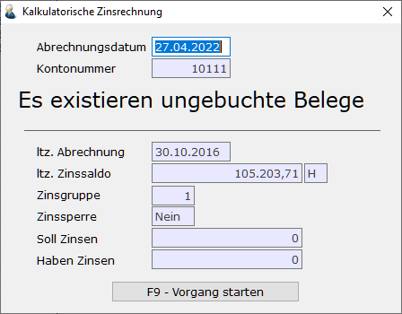
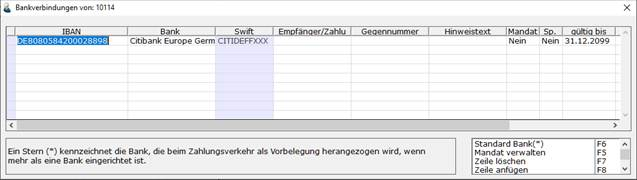
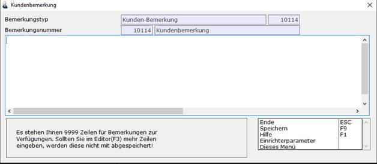
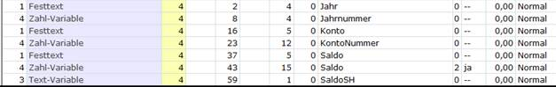

# Funktionen der Konteninformation

<!-- source: https://amic.de/hilfe/funktionenderkonteninformation.htm -->

Hauptmenü > Finanzbuchhaltung > Information > Konteninformation

Direktsprung **[KOI]**.

Da die Konteninformation als Werkzeug dienen kann, bei direktem Kundenkontakt schnell Informationen über z.B. Kontostand oder fällige Zinsen zu erhalten, sind hier entsprechende Funktionen hinterlegt:

#### Zinsrechner

  
    

Dies ist der aus der Zinsrechnung bekannte Zinsrechner, der sich alle Werte aus den Stammdaten ermittelt (siehe Dokumentation Zinswesen). Nach Eingabe des Abrechnungsdatums werden die seit der letzten Zinsabrechnung anfallenden Zinsen ermittelt und angezeigt. Da zur Zinsabrechnung nur gebuchte Belege herangezogen werden erscheint ggf. die Meldung „Es existieren ungebuchte Belege“.

#### Konto ändern F3

Springt in das Feld Kontonummer, um eine anderes Konto auszuwählen.  
    

#### Infoblatt drucken F10

Diese Funktion steht hier für Sach- und Personenkonten zur Verfügung. Man erreicht den Report auch über:

Hauptmenü > Abschlussarbeiten > Kontoblätter > Infoblattdruck

Direktsprung **[KOID]**.

Es wird ein Crystal-Report aufgerufen, der die gebuchten Daten des ausgewählten Jahres und Kontos druckt. Man kann in der Bereichsauswahl **F2** die Daten auch zusätzlich noch über die Periode eingrenzen.

Dieser Report ist ähnlich wie ein Kontoblatt zu sehen, nur werden die Daten nicht erst zusammengesucht und festgehalten, sondern immer so ausgewertet wie zum Zeitpunkt des Druckes sind. Für Sachkonten wird die Druckverdichtung analog der Einstellung im [Sachkontenstamm](../stammdaten_der_fibu/sachkonten.md#RegisterWeitereOptionen) unter **Formulardruck** ausgegeben.

#### Archiv Kokore

Diese Funktion steht nur bei Personenkonten zur Verfügung. Es werden alle archivierten Kokores dieses Kontos im angegebenen Jahr aufgelistet und können dann angezeigt werden. Für genauere Informationen über das Archivwesen steht die Formulararchivdokumentation zur Verfügung.

#### Archiv STRG+F12

Hier werden alle Archiveinträge des ausgewählten Personenkontos angezeigt, unabhängig von Belegart und Jahr.

#### Fibu-Merkmale

Diese Funktion steht nur bei Personenkonten zur Verfügung. Man erhält hier einen Überblick über die eingerichteten, für die Finanzbuchhaltung relevanten Merkmale. Detaillierte Informationen findet man in der Dokumentation unter „Kunden und Lieferanten“ und dort im Unterpunkt „Kundenstamm“ und „Fibu-Merkmale“.

#### Kundenbank ändern

Hier hat man die Möglichkeit, die zu einem Kunden eingerichtete Bankverbindung einzusehen und zu ändern. Dies ist dieselbe Funktion wie im Kunden- bzw. Lieferantenstamm.

  
    

#### Kundenbemerkungen

Diese Funktion steht nur für Personenkonten zur Verfügung. Es werden hier die Bemerkungstexte, die man im Kunden-/Lieferantenstamm erfasst hat, angezeigt und können auch geändert werden. Man hat bis zu 9999 Zeilen für freien Text zur Verfügung.

  
    

#### Kurzliste F4

Wie auch bei allen Standard-Auswahllisten lässt sich hier eine Kurzliste drucken. Vor dem Druck wird die Druckernummer - so wie sie im Druckerstamm eingerichtet ist - und das Formular für die Kurzliste abgefragt. Es wird immer das zuletzt verwendete Formular vorgeschlagen, wobei hier nach Oberkonto, Sachkonto und Personenkonto unterschieden wird. Ein über das Schlüsselwort **FORM** in der Variante angegebenes Formular wird in der Konteninformation ignoriert.

Auf den Kurzlistenformularen für die Konteninformation bzw. auch der OP-Verwaltung können zusätzlich die Kontonummer, die Jahrnummer und der Saldo angedruckt werden. Die Einrichtung kann dann wie folgt aussehen:

