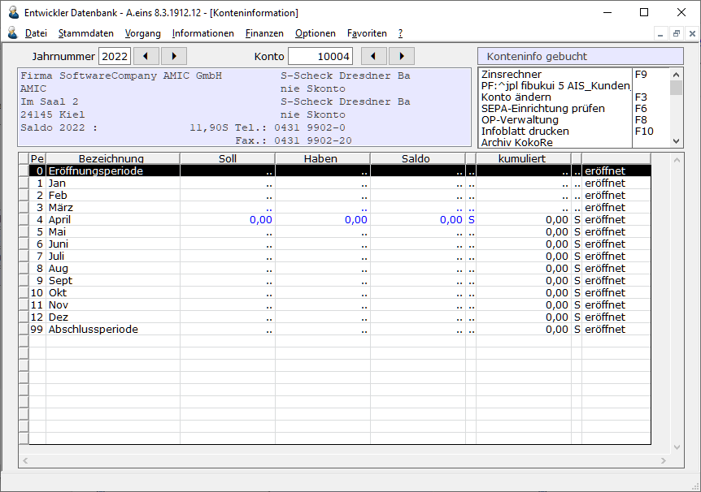
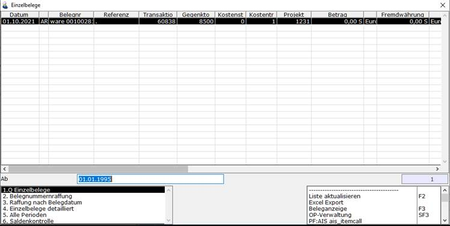
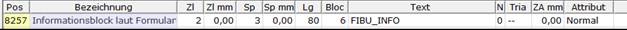
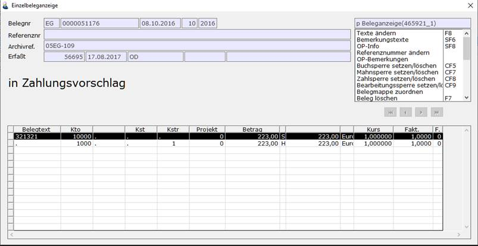

# Konteninformationen

<!-- source: https://amic.de/hilfe/konteninformationen.htm -->

Hauptmenü > Finanzbuchhaltung > Information > Konteninformation

Direktsprung **[KOI]**.

Die Konteninformation existiert in zwei Ausprägungen:

1. Konteninformation nur für Personenkonten

2. Konteninformation für Sach-, Ober- und Personenkonten

Hier können Informationen über die Buchungen auf Sach- und Personenkonten mit unterschiedlichem Verdichtungsniveau abgerufen werden. Nach Eingabe des gewünschten Jahres und des Kontos erscheint folgende Anzeige:

  
    

Mit Hilfe der Buttons mit den Pfeilen kann zwischen den Jahren und den Konten geblättert werden. Beim Blättern zwischen den Konten wird zum nächsten oder vorangegangene Konto desselben Kontotyp – Sachkonto, Personenkonto oder Oberkonto – geblättert. Dabei wird zusätzlich geprüft, ob dieses Konto den Einschränkungen in der F3-Auswahl entspricht, so dass man ggf. die Möglichkeit hat, durch private Varianten bestimmte Kontobereiche auszublenden.

Unterhalb des Abfragefeldes befindet sich ein Informationsfenster, das sich über die Formulareinrichtung mit dem Formulartyp „240 Fibu-Bildschirm-Konteninformation“ einrichten lässt. Die Formularnummer dieses Informationsfensters kann in den Bedienerklassen hinterlegt werden. Ist kein Formular hinterlegt, wird das Standardformular -99 verwendet.

In der Liste werden die Perioden in der Reihenfolge Eröffnungsperiode, Normalperioden, Abschlussperioden angezeigt und die zu dem ausgewählten Konto gehörenden Werte angezeigt. Es werden standardmäßig vier Varianten ausgeliefert, die über **F2** ausgewählt werden können:

- **Konteninfo erfasst:** Dies sind die Werte, wie sie direkt nach der Eingabe im System stehen.
- **Konteninfo gebucht:** Erst beim Buchen der Belege werden diese Werte aktualisiert. Diese  
Werte entsprechen denen, die auch in der Summen und Saldenliste, GuV bzw. Bilanz  
auftauchen.

- **Konteninfo nach Belegart:** Hier werden die Summen nach Belegart getrennt aufgelistet.
- **Konteninfo mit Währungsauflösung:** Diese Variante erscheint nur wenn der **SPA 673** „**Anzeige Fremdwährung in Auswahllisten**“ gesetzt ist. Diese enthält zwei zusätzliche Spalten „zum Stichtag“ und „Differenz“. Weiterhin wird pro Periode und Währung, die auf dieses Konto in dem aktuellen Jahr gebucht wurde, eine Zeile ausgegeben. In der Spalte „zum Stichtag“ findet man den Betrag in Buchwährung, der sich aus dem kumulierten Fremdwährungsbetrag und dem am Monatsende gültigen Währungskurs ergibt. Die Differenz ist dann der Betrag, der sich aus der Differenz vom Betrag „zum Stichtag“ und dem Betrag, der zum am Tag der Erfassung gültig war, ergibt.  
    

Wenn detaillierte Informationen über eine Periode gewünscht werden, kann diese Periode mittels Mausklick oder Cursorpositionierung mit anschließender Bestätigung ausgewählt werden. In diesem Fall werden die Einzelzeilen in der Periode angezeigt. In der Variante „Konteninfo mit Währungsauflösung“ werden auch nur die Belege angezeigt, die zu der Zeile – also nur die jeweils ausgewählte Währung – gehören.

  
Links unten im Anzeigebildschirm werden verschiedene Anzeigevarianten zur Verfügung gestellt. Bei [Sachkonten](../stammdaten_der_fibu/sachkonten.md) kann in den Stammdaten eingestellt werden, welche Variante beim Einstieg verwendet wird (Optionen Konteninfo / Ansicht).

Die hier angezeigten Belege können sofort über die Funktion ***Druck Kurzliste*** **F4** gedruckt werden. Bei diesen Kurzlisten gibt es eine Besonderheiten. Man kann im Kopf dieser Liste die Daten des Informationsfensters, welches man über Formulartyp „240 Fibu-Bildschirm-Konteninformation“ eingerichtet hat, anzeigen. Dazu muss man im Formular der Kurzliste ein Feld vom Typen ID_FIBU_INFO einrichten, bei dem als Text „FIBU_INFO“ steht.

Zusätzlich muss man der F3-Auswahl mitteilen, welche Kontonummer und ggf. welches Jahr angezeigt werden sollen. Dies geschieht durch das Schlüsselwort:

FIBU_INFO :KONTO, :JAHR

Dabei sind :KONTO und :JAHR die Variablen, die auch in dieser F3-Auswahl für die Eingrenzung der Daten verwendet werden. Die von AMIC ausgelieferten Varianten sind bereits mit diesem Schlüsselwort versehen. Sie müssen immer in dieser Reihenfolge durch Komma getrennt angegeben werden.

    
Wird eine Zeile mit der Maus angeklickt oder Return (**Enter**) bzw. **F3** gedrückt, so wird je nach Art der Zeile entweder der komplette Buchungssatz angezeigt oder die Funktion ***Text ändern*** oder ***OP-Bemerkungen*** aufgerufen. Diesen Anzeigebildschirm findet man immer dort wieder, wo Belege aufgelistet werden, z.B. OP-Verwaltung, Standardvorgänge Fibu, Primanota bzw. Steuerauswertungen.

  
    

Die [Einzelbeleganzeige](../op_verwaltung/einzelbeleganzeige.md) ist eins der zentralen Werkzeuge in der Finanzbuchhaltung um Informationen über einen Beleg schnell zu erhalten und diese ggf. zu ändern.

Siehe auch:

- [Funktionen der Konteninformation](./funktionen_der_konteninformation.md)
