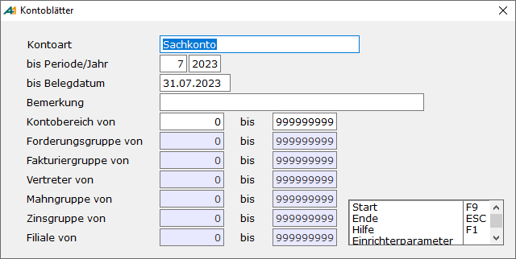

# Kontoblätter erstellen

<!-- source: https://amic.de/hilfe/_kontoblaettererstellen.htm -->

Hauptmenü > Abschlussarbeiten > Kontoblätter > Kontoblätter bearbeiten > Funktion ***Kontoblätter erstellen* F9**

Direktsprung **[KOD]**

Innerhalb des Eingabebildschirms werden die Eingrenzungen vorgenommen, mit deren Hilfe die Kontoblätter erstellt werden.

  <table>
    <tbody>
      <tr>
        <td colspan="2"></td>
        <td>
          
<strong>Beschreibung</strong>

        </td>
      </tr>
      <tr>
        <td>
          
<strong>Kontoart</strong>

        </td>
        <td colspan="2">
          
Sachkonto, Personenkonto, Debitoren, Kreditoren oder Kontokorrent

        </td>
      </tr>
      <tr>
        <td>
          
<strong>bis Periode/Jahr</strong>

        </td>
        <td colspan="2">
          
Eingabe Periode Jahr bis zu der/den Buchungen berücksichtigt werden

        </td>
      </tr>
      <tr>
        <td>
          
<strong>bis Belegdatum</strong>

        </td>
        <td colspan="2">
          
Eingabe des Datums bis zu den Buchungen berücksichtigt werden Bei der Erstellung von Kontoblättern für Forderungs-/Verbindlichkeitskonten für die Methode „Saldo Stichtag“ wird das Belegdatum nicht berücksichtig.

        </td>
      </tr>
      <tr>
        <td>
          
<strong>Bemerkung</strong>

        </td>
        <td colspan="2">
          
Eingabe Wahlfreier Text

        </td>
      </tr>
      <tr>
        <td>
          
<strong>Kontobereich von ... bis ...</strong>

        </td>
        <td colspan="2">
          
Eingrenzung der Konten

        </td>
      </tr>
    </tbody>
    <tbody>
      <tr>
        <td></td>
        <td></td>
        <td></td>
      </tr>
    </tbody>
  </table>

Ist als Kontoart Personenkonto bzw. Debitor/Kreditor oder Kontokorrent angewählt, so kann man auch die auf der Abbildung deaktivierten Felder zur Eingrenzung verwenden.

Wird dieser Vorgang mit **F9** gestartet werden alle noch in keinem Kontoblatt enthaltenen Belege zusammengesucht. Vor dem Erstellen der Kontenblätter wird noch geprüft, ob noch ungebuchte Belege in diesen Bereichen vorkommen. Außerdem wird pro Konto geprüft, ob für das Konto bereits ein Kontoblatt für eine spätere Periode existiert. Nach dem Durchlauf wird dann die Meldung „Kontoblatt für Konto ….. nicht erstellt, da bereits Kontoauszüge einer späteren Periode existieren!“

Will man Kontoblätter für Forderungs-/Verbindlichkeitskonten bei Verwendung der Methode „Saldo Stichtag“ erstellen, so geht dies nur, wenn die Perioden bereits abgeschlossen (Direktsprung PERAF) wurden.

<strong>ACHTUNG: </strong><em>Sollte das Erstellen der Kontoblätter abgebrochen werden, so müssen die teilweise bearbeiteten Belege wieder freigeschaltet werden. Dazu muss im </em>[*Fibureorganisator*](../fibu_reorganisator/fibu_reorganisator_allgemein.md) *(Direktsprung FIREO) der Funktion „**Reorg. Fragmente**“ angewählt werden.*
