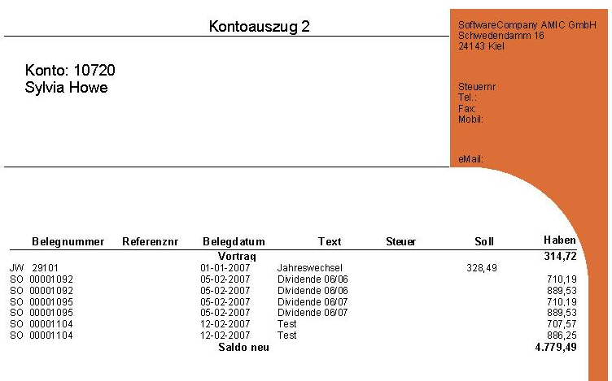

# Kontoblätter mit dem AMIC Etikettendruck drucken

<!-- source: https://amic.de/hilfe/kontoblttermitdemamicetiketten.htm -->

Hauptmenü > Administration > Werkzeuge > Etikettendruck

Direktsprung **[FRM]**

Man kann sich mit dem AMIC Etikettendruck eigene Kontoblätter erstellen. Damit hat man die Möglichkeit sich alle Daten, die auf Kontoblättern benötigt werden, zusammen zu suchen und den Report so zu gestalten, dass auch das Design das eigene Unternehmen wiederspiegelt. In den Vorlagen zum AMIC Etikettendruck existiert ein Report „Kontoblatt“. Diesen kann man mit der Anwendung „KONTOBLATT_INTERN“ (Kontoblätter) oder „KONTOBLATT_ARCHIV“ (Kokore) verbinden und so die erstellten Kontoblätter ausdrucken bzw. den Report bearbeiten.

Die Daten dieses Vorlagekontoblattes werden auf Basis eine Views („p_etikettendruck_kontoblatt“) zusammengesucht und dann als Liste ausgedruckt.

Die Firmenanschrift ist fest im Beispielreport eingetragen und muss angepasst werden.

Als Steuerinformation wird der im Steuersatz hinterlegte Exportschlüssel ausgegeben. So kann man die Kombination aus Klasse, Gruppe und Schlüssel auch für Kunden, die ggf. diesen Report als Kokore erhalten, lesbar darstellen.
