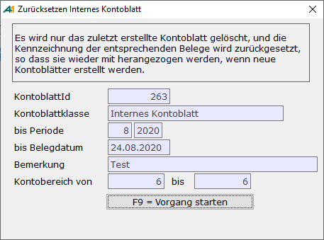

# Kontoblätter zurücksetzen

<!-- source: https://amic.de/hilfe/kontobltterzurcksetzen.htm -->

Hauptmenü > Abschlussarbeiten > Kontoblätter > Kontoblätter bearbeiten > Funktion ***Kontoblätter zurücksetzen* F7**

Direktsprung **[KOD]**

Bei Anwahl dieses Punktes erscheint folgender Bildschirm:

Hier ist ganz wichtig zu beachten, dass nicht das ausgewählte, sondern immer das zuletzt erstellte Kontoblatt gelöscht wird.
