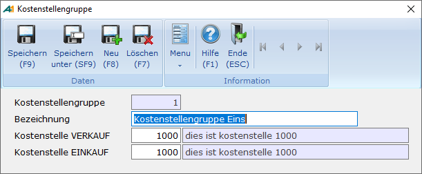

# Kostenstellengruppe

<!-- source: https://amic.de/hilfe/_kostenstellengruppe.htm -->

Hauptmenü \> Kostenrechnung \> Kostenstellenstamm \> Kostenstellengruppe

Direktsprung **[KSTG]**

Über die Kostenstellengruppe werden die Verkaufs- und Einkaufsbuchungen der Warenwirtschaft automatisch auf den Kostenstellen verbucht. Eine Kostenstellengruppe wird dem Artikel zugeordnet. Sie enthält jeweils eine Kostenstelle für den Verkauf und den Einkauf.

