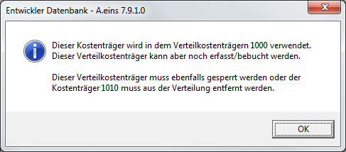
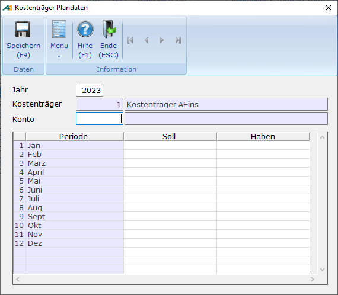
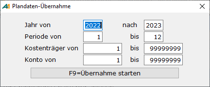

# Kostenträger

<!-- source: https://amic.de/hilfe/kostentrger.htm -->

Hauptmenü \> Kostenrechnung \> Kostenträgerstamm \> Kostenträger

Direktsprung **[KSTRS]**

Um mit Kostenträgern zu arbeiten, gibt es folgende Vorbedingungen bzw. Einstellungsvoraussetzungen:

1. Der Steuerparameter "Kostenträgerrechnung angeschlossen" muss gesetzt sein.

2. Die Kostenträger müssen eingerichtet sein. Hierzu gibt es zwei Stammdatenpfleger

   - Kostenträger (ohne Verteilung)
   - Verteilkostenträger (mit Verteilung)

3. Im [Sachkontenrahmen](../stammdaten_der_fibu/sachkonten.md) Direktsprung **[SKS]** muss bei den in Frage kommenden Aufwandskonten im Feld Sperre Kostenträger aus folgenden Eintragsmöglichkeiten gewählt werden

- **Gesperrt** Es wird kein Kostenträger abgefragt
- **Kann** Es kann ein Kostenträger eingeben werden, muss aber nicht
- **Muss** Es muss ein Kostenträger eingegeben werden.
- **Fest** Es muss der im Sachkontenstamm festgelegte Kostenträger verwendet werden.

  Im Feld Kostenträger kann hier die Nummer eines Kostenträgers eingegeben werden, der dann bei der Belegerfassung automatisch vorgeschlagen wird.

4. Damit auch Rechnungen aus der Warenwirtschaft beim Fibu -Übertrag automatisch in die Kostenträgerrechnung eingetragen werden können, ist es nötig, Kostenträgergruppen zu definieren, in denen die Kostenträger des Artikels für Einkauf und Verkauf angegeben werden können.  
Diese werden dann im Artikel über die Funktion ***Kostenst./Statistik/Abteil*** gepflegt, und wenn dann der Artikel im Vorgang angesprochen wird, wird der jeweilige Kostenträger bebucht.  
    

5. Im Mandantenstamm sollte ein Fehlerkostenträger eingerichtet werden. Dieser Kostenträger wird herangezogen, wenn zu GuV-Konten versehentlich kein Kostenträger hinterlegt ist und die „Sperre Kostenträger“ des angesprochenen Kontos nicht auf **Gesperrt** oder **Fest** seht.

**Erfassung der Kostenträger**

Folgende Felder können in dem folgenden Eingabebildschirm erfasst werden

| | Beschreibung |
| --- | --- |
| Kostenträger | Nummer des Kostenträgers. Es ist zwar möglich einen Kostenträger mit der Nummer 0 zu erfassen, jedoch wird dieser nicht als Kostenträger ausgewertet. 0 bedeutet immer „Kein Kostenträger“   |
| Bezeichnung   | Bezeichnung des Kostenträgers (sprechende und eindeutige Namen erleichtern hier die spätere Suche (Bsp.: KFZ-KI-QM-12345).  |
| Matchcode   | Kurzbezeichnung des Kostenträgers  |
| Erfassungssperre   | Diese Sperre gilt für die Belegerfassung der Finanzbuchhaltung. Steht diese auf Ja, so kann der Kostenträger dort nicht mehr verwendet werden. Auch ist es nicht mehr möglich diesen Kostenträger als Verteilkostenträger bzw. in den Kostenträgergruppen zu verwenden. Ist sie bereits in irgendeinem Verteilkostenträger eingetragen, so erscheint die Meldung:  Die hier angesprochenen Arbeitsschritte müssen manuell durchgeführt werden. Wird in einem Beleg ein gesperrter Kostenträger verwendet - dies ist z.B. dann möglich, wenn die Sperre erst nach der Verwendung des Kostenträgers gesetzt wurde oder ein gesperrter Kostenträger in einem nicht gesperrten Verteilkostenträger verwendet wird -, so wird der Beleg nicht gebucht. Es erscheint die Meldung „**Kostenträger … ist gesperrt!**“ im Buchungsprotokoll.  |
| Druckpositionen   | Im Feld Druckposition muss eine Kostenträger-Druckposition (Direktsprung **[KSTRP]**) eingetragen werden, die den Ausdruck der Kostenträgerauswertung steuert. Kostenträger mit gleicher Kostenträger-Druckposition werden gemeinsam mit einer Zwischensumme ausgedruckt.  |
| Externe Aw. Pos.   | Hier können für eigene Auswertungen Druckpositionen hinterlegt werden. A.eins verwendet diese Felder nicht. Es ist jedoch möglich, eigene F3-Auswahlen/Itemboxen zu hinterlegen. Dafür muss man die Einrichterparameter „Itembox für externe Auswertungsposition 1-3“ und (optional) „Bezeichnungsfeld für ext. Auswertungsposition 1-3“ hinterlegen. Beispielsweise könnte man als Itembox für ext.Auswertungsposition 1 „IB_LAGERSTAMM“ und (auch optional) „Label für externe Auswertungsposition 1-3“ hinterlegen. Um dann hinter der externen Auswertungsposition die Bezeichnung zu sehen, muss man das Bezeichnungsfeld aus der Itembox in „Bezeichnungsfeld für ext. Auswertungsposition 1“ angeben. Dies wäre dann in diesem Fall „Lagerbezeich“.  |
| Bemerkungen   | Hier kann ein wahlfreier Text zu dem jeweiligen Kostenträger erfasst werden.  |

#### Erfassung der Planzahlen

Die Erfassung der Planzahlen für Kostenträger erreicht man über:

Hauptmenü \> Kostenrechnung \> Kostenträgerstamm \> Kostenträger \> Funktion „**Plandaten erfassen**“

Direktsprung **[KSTRS]**

Planzahlen für Kostenträger müssen pro Jahr, Periode und Konto erfasst werden. Hat man die Funktion „<strong>Plandaten erfassen“</strong> ausgewählt, so erscheint folgende Erfassungsmaske:

Neben der manuellen Erfassung stehen noch zusätzliche Funktionen zur Verfügung:

- Vorjahresplandaten: Die zu diesem Kostenträger und Konto im Vorjahr erfassten Werte werden automatisch in die Soll und Habenspalte übernommen.
- Plandaten aus 1.Periode: Die Werte, die in Periode 1 eingetragen wurden, werden in alle anderen Perioden übernommen.
- Löschen Plandaten: Alle Werte dieser Kostenträger/Jahr/Kontonummern-Kombination werden auf 0.0 gesetzt.
- Übernahme Plandaten: Es öffnet sich eine weiter Maske, in der der Bereich abgefragt wird, aus dem die Kostentägerplanzahlen übernommen werden sollen:

