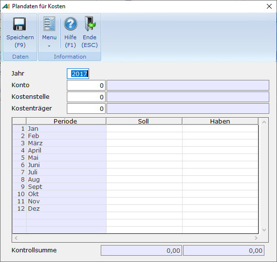
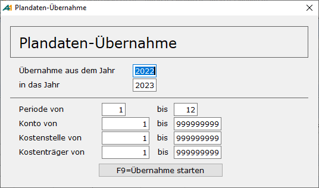

# Plandaten

<!-- source: https://amic.de/hilfe/plandaten.htm -->

Plandaten lassen sich auf verschiedene Ebenen erfassen:

1) [Für Konten und Kostenstelle.](./kostenstellen.md#KostenstellenPlanzahlen)

2) [Für Konten und Kostenträger](./kostentraeger.md#KostentraegerPlanzahlen).

3) Für Konten, Kostenstellen und Kostenträger.

Die Erfassung der Planzahlen für die Kombination aus Konto, Kostenstelle und Kostenträger erreicht man über den Direktsprung **[PLAN]**.

Neben der einfachen Erfassung stehen noch folgende Funktionen zur Verfügung

- Vorjahresplandaten: Die zu diesem Kostenträger und Konto im Vorjahr erfassten Werte werden automatisch in die Soll und Habenspalte übernommen.
- Plandaten aus 1.Periode: Die Werte, die in Periode 1 eingetragen wurden, werden in alle anderen Perioden übernommen.
- Übernahme Plandaten: Es öffnet sich eine weiter Maske, in der der Bereich abgefragt wird, aus dem die Planzahlen übernommen werden sollen.

