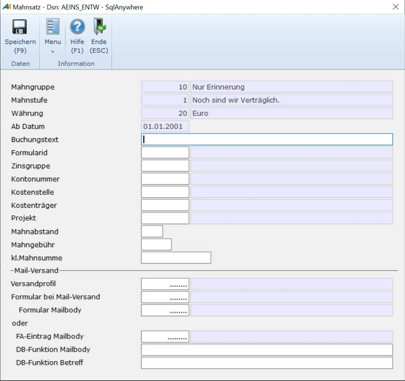

# Mahnsätze einrichten

<!-- source: https://amic.de/hilfe/mahnstzeeinrichten.htm -->

Hauptmenü > Mahn-, Zahl-, Zinswesen > Stammdaten > Mahnwesen einrichten

Direktsprung **[FIMSG]**.

Dieser Pfleger fasst alle vorherigen Pfleger für die Mahnstammdaten zusammen. Es werden die einzelnen Mahngruppen untereinander und die Mahnstufen nebeneinander dargestellt.

 

Über Anzeige lässt sich einstellen, welcher Wert in der Kreuztabelle angezeigt werden soll.

Der Text der Mahnstufe lässt sich ändern, indem man auf das Feld klickt oder mit ENTER bestätigt: Neue Mahnstufen lassen sich über <strong>(Neu)</strong> eintragen.

Die linke Spalte mit den [Mahngruppen](./mahngruppen.md) funktioniert analog. Man gelang also direkt von der Kreuztabelle in den Stammdatenpfleger.

Wenn man nun in die Kreuztabelle klickt oder mit ENTER ein Feld auswählt, erscheint ein Pfleger, der sowohl den Mahnstamm als auch den Mahnsatz beinhaltet. Es wir dort immer der aktive Datensatz, also der mit dem größten "**Ab Datum**", angezeigt. Will man ab einem bestimmten Datum einen neuen Mahnsatz einrichten, so erreicht man dies über "***Neuer Satz*** **F8**". Die [Texte](./mahntexte.md) für diese Kombination lassen sich über "***Texte*** **F5**" erfassen.

  <table>
    <tbody>
      <tr>
        <td></td>
        <td>
          
<strong>Beschreibung</strong>

        </td>
      </tr>
      <tr>
        <td>
          
Mahngruppe

        </td>
        <td>
          
Angabe der Mahngruppe, für die die Bedingungen gelten

        </td>
      </tr>
      <tr>
        <td>
          
Mahnstufe

        </td>
        <td>
          
Angabe der Mahnstufe, für die die Bedingungen gelten sollen, z.B. <strong>"1"</strong> für <strong>"Mahnstufe 1"</strong><strong></strong>

        </td>
      </tr>
      <tr>
        <td>
          
Währung  

        </td>
        <td>
          
Währung, für die die Mahngebühr gilt.

        </td>
      </tr>
      <tr>
        <td>
          
Ab Datum  

        </td>
        <td>
          
Ab wann gelten diese Einstellungen.

        </td>
      </tr>
      <tr>
        <td>
          
Buchungstext

        </td>
        <td>
          
Ist hier ein Text eingegeben, so wird dieser bei der Übernahme der Mahngebühren in die Primanota verwendet, sonst der bei „<a href="./mahnungen_bearbeiten.md#MahnungenBuchen">Übernahme in die Primanota</a>“ als Einrichterparameter hinterlegte Buchungstext „Text Hauptzeile bei Übernahme der Mahnungen in die Primanota“

        </td>
      </tr>
      <tr>
        <td>
          
Formular-Id  

        </td>
        <td>
          
Nummer des Mahnformulars, das ausgedruckt werden soll. Es kann somit für jede Kombination aus Mahngruppe und Mahnstufe ein eigenes Formular mit unterschiedlichem Aufbau bzw. Text hinterlegt werden. Man kann aber auch für jede Stufe dasselbe Formular hinterlegen und die unterschiedlichen Mahnstufen durch die Mahntexte kenntlich machen.

        </td>
      </tr>
      <tr>
        <td>
          
Zinsgruppe

        </td>
        <td>
          
Falls Verzugszinsen berechnet werden sollen, wird hier die Zinsgruppe angegeben, deren Werte berücksichtigt werden sollen. Bei der Berechnung der Mahnzinsen wird nur der Soll-Zinssatz herangezogen.

        </td>
      </tr>
      <tr>
        <td>
          
Kontonummer

        </td>
        <td>
          
Mahngebühren werden auf dieses Konto gebucht.

        </td>
      </tr>
      <tr>
        <td>
          
Kostenstelle

        </td>
        <td>
          
Bei der Übernahme in die Primanota wird diese <a href="../kostenrechnung/kostenstellen.md">Kostenstelle</a> verwendet.

        </td>
      </tr>
      <tr>
        <td>
          
Kostenträger

        </td>
        <td>
          
Bei der Übernahme in die Primanota wird dieser <a href="../kostenrechnung/kostentraeger.md">Kostenträger</a> verwendet.

        </td>
      </tr>
      <tr>
        <td>
          
Kostenobjekt

        </td>
        <td>
          
Bei der Übernahme in die Primanota wird dieses <a href="../kostenrechnung/kostenobjekte/index.md">Kostenobjekt</a> verwendet.

        </td>
      </tr>
      <tr>
        <td>
          
Mahnabstand

        </td>
        <td>
          
Der Mahnabstand zwischen zwei Mahnungen. Häufig wird von der Fälligkeit bis zur ersten Mahnung noch eine Schonfrist gewährt. In diesem Fall muss hier bei Mahnstufe 1 ein Zeitraum von z.B. 14 Tagen eingetragen werden, für Mahnstufe 2 und höher wird dann z.B. 10 Tage eingetragen. Somit sind auch unterschiedliche Intervalle je Stufe möglich.

        </td>
      </tr>
      <tr>
        <td>
          
Mahngebühr

        </td>
        <td>
          
Welche Mahngebühr soll gezogen werden? In der Mahngruppe ist hinterlegt, ob die Mahngebühr der kleinsten oder der größten Mahnstufe der Mahnung gezogen werden soll.

        </td>
      </tr>
      <tr>
        <td>
          
Kleinste Mahnsumme

        </td>
        <td>
          
Wenn beim automatischen Erstellen einer Mahnung die zu mahnende Summe kleiner als der hier eingetragene Betrag ist, werden für diesen Kunden keine Mahnvorschläge erstellt.

        </td>
      </tr>
      <tr>
        <td colspan="2">
          
<b>Alle folgenden Felder (Versandprofil, Formular bei Mail-Versand, Formular Mailbody, Fa-Eintrag Mailbody, DB-Funktion Mailbody, DB-Funktion Betreff) erscheinen nur bei aktiver Belegversand-Lizenz. Sie sind unter </b><a href="./mahnstamm.md#MahnStammMailVersand">Mahnstamm</a><b> dokumentiert.</b>

        </td>
      </tr>
    </tbody>
  </table>

