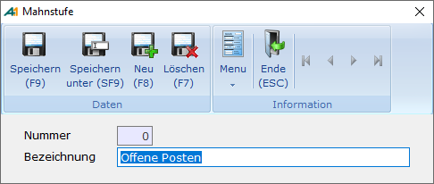

# Mahnstufen

<!-- source: https://amic.de/hilfe/mahnstufen.htm -->

Hauptmenü > Mahn-, Zahl-, Zinswesen > Stammdaten > Mahnwesen einrichten > Funktion Mahnstufen **F7**

Direktsprung **[FIMSG]**.

Hierbei handelt es sich lediglich um Texte für die verschiedenen Mahnstufen in einem Unternehmen.

**Nummer**

Laufende Nummer der Mahnstufe

**Bezeichnung**

Textbeschreibung der Mahnstufe z.B. 3.Mahnstufe. Dieser Text kann im Mahnformular im Bereich 307 (Summen pro Mahnstufe) mit ausgegeben werden. Ist der Steuerungsparameter 34 "Mehrsprachigkeit aktiv“ in A.eins gesetzt, so hat man auf diesem Feld die Möglichkeit mit F3 [sprachabhängige Bezeichnungen](../../firmenstamm/a_eins_sprache/sprachabhaengige_bezeichnung_in_den_stammdaten.md) zu pflegen.
