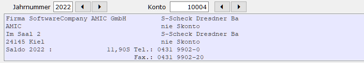

# Formular Fibu-Infofenster

<!-- source: https://amic.de/hilfe/formularfibuinfofenster.htm -->

In der Finanzbuchhaltung ist es oft notwendig zusätzlich Informationen – z.B. Kontosaldo, Telefonnummer, … - zu einem Konto anzuzeigen. Diese Informationen werden in einem blau eingefärbten Bereich – Fenster - angezeigt, der selber eingerichtet und pro Bedienerklasse hinterlegt werden kann. Dieses Fenster findet man unter anderem in der Konteninformation oder der OP-Verwaltung.

Die Informationen werden über ein Formular vom Typ 240 „Fibu-Bildschirm-Konteninfo“ zusammengestellt. Zu diesem Formular existieren vier Bereiche:

- 625 Bildschirm-Personenkonten
- 626 Bildschirm-Bilanzkonten
- 627 Bildschirm-GuV-Konten
- 628 Bildschirm-Oberkonten

Es kann also pro Kontotyp eine andere Darstellung der Information hinterlegt werden. Von AMIC wird eine Standardeinrichtung mit der Formularnummer -99 ausgeliefert.

Für Kurzlisten, die dort gedruckt werden, wo Fibu-Infofenster aktiv sind, kann dieser Bereich auch mit angedruckt werden. Dazu müssen zwei Einrichtungen vorgenommen werden:

1. In dem verwendeten Kurzlistenformular muss die Druckposition ID_FIBU_INFO eingerichtet werden.

2. In dem SQL-Text der betroffenen Auswahllisten und F3-Auswahlen muss das Schüsselwort FIBU_INFO gefolgt von den Feldern, die das Konto bzw. das Jahr bestimmen, eingerichtet sein. Beispiel:  
    
FIBU_INFO :KONTO, :JAHR  
    
Für die Standard-Auswahllisten ist dieses Schlüsselwort bereits in den SQL-Texten enthalten, so dass ggf. nur das Kurzlistenformular angepasste werden muss.
