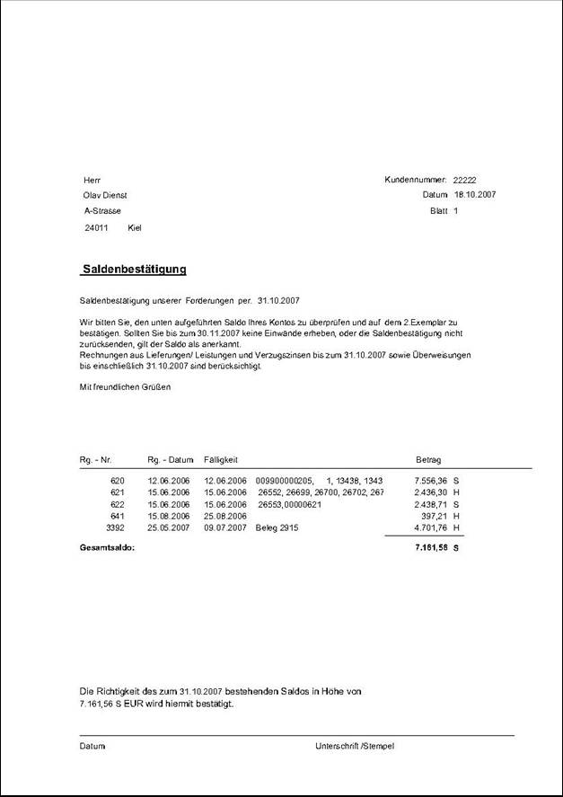

# Saldenbestätigung drucken

<!-- source: https://amic.de/hilfe/saldenbesttigungdrucken.htm -->

Hauptmenü > OP-Verwaltung > Information und Abstimmung > Saldenbestätigung

Die Saldenbestätigung druckt den Stand der offenen Posten zu einem bestimmten Stichtag aus. Es werden auch Konten mit Saldo 0 gedruckt, solange zu diesem Stichtag offene Posten existieren. Will man alle Kunden, also auch diejenigen, die zum Stichtag keine offenen Posten mehr haben, andrucken, so kann man in der **F2**\-Auswahl hinter „**Auch Kunden ohne OP’s drucken**“ **Ja** eintragen. Es werden dann auch die Kunden ohne OP’S gedruckt, wenn irgendwann vor dem Stichtag für diesen Kunden offene Posten existierten. Es erscheint dann anstelle der Liste nur der Text „Zum Stichtag sind keine offenen Posten vorhanden.“. Man kann diesen Text in der **F2**\-Auswahl in dem Feld „**Hinweistext keine OP’s**“ überschreiben.

Zusätzlich werden der **Stichtag**, der **Kontenbereich** und das Datum bis zu dem die **Antwort** erwartet wird, abgefragt. **Stichtag** und **Antwort bis** werden in den Text der Saldenbestätigung mit übernommen.

Beispielausdruck einer Saldenliste

(Stand 18.10.2007)
