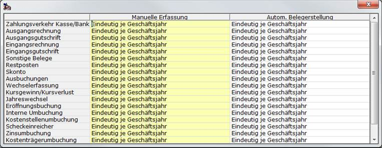

# Eindeutigkeit

<!-- source: https://amic.de/hilfe/eindeutigkeit.htm -->

Hauptmenü \> Administration \> Nummernkreise \> Fibu-Vorgangszuordnung \> Funktion **F6** ***Eindeutigkeit***

Direktsprung **[NKF]**

Es können hier pro Belegart für manuelle und für automatische Belegerstellung unterschiedliche Werte angegeben werden.

Mögliche Werte sind:

- manuelle Nummernvergabe
- Nummernvorschlag
- Eindeutiger Nummernvorschlag
- Eindeutig pro Geschäftsjahr & Vorgang
- Eindeutig je Vorgang
- Eindeutig je Geschäftsjahr
- Eindeutig im Gesamtsystem

Die Eindeutigkeit der Nummer wird immer im Zusammenhang mit dem Nummernkreis geprüft. Bei "manueller Nummernvergabe", "Nummernvorschlag" und "eindeutiger Nummernvorschlag" muss die Eindeutigkeit der Belegnummer durch geeignete betriebliche Mittel gewährleistet werden.
