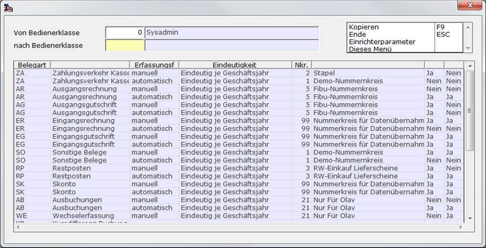
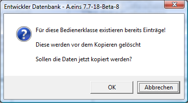

# Für Bedienerklasse kopieren

<!-- source: https://amic.de/hilfe/frbedienerklassekopieren.htm -->

Hauptmenü > Administration > Nummernkreise > Fibu-Vorgangszuordnung > Funktion ***Bedienerklasse kopieren***

Direktsprung **[NKF]**

Wenn man eine neue Bedienerklasse eingerichtet hat, kann man die Nummernkreiszuordnung der Finanzbuchhaltung aus einer anderen Bedienerklasse kopieren. Dazu steht in der Anwendung „Nummernkreise Finanzbuchhaltung“ zur Verfügung.

In dem Feld „**Von Bedienerklasse**“ gibt man eine bestehende Bedienerklasse an, die als Grundlage dienen soll. Hat man die Bedienerklasse ausgewählt werden in der Tabelle im unteren Bildschirmteil die dieser Bedienerklasse zugeordneten Einstellungen angezeigt. Das Feld „**nach Bedienerklasse**“ ist die neue Bedienerklasse, für die man die Einrichtung übernehmen will.

Wenn man die Funktion startet wird geprüft, ob für die neue Bedienerklasse eventuell bereits Daten existieren und vor dem Kopiervorgang darauf hingewiesen.

Ist der Kopiervorgang erfolgreich beendet worden, so erscheint ein kurzer Hinweis.
