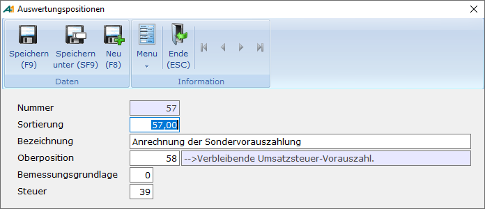

# Dauerfristverlängerung/Sondervorauszahlung

<!-- source: https://amic.de/hilfe/dauerfristverlngerungsondervor.htm -->

Hauptmenü > Abschlussarbeiten > Umsatzsteuer > Umsatzsteuerwerte

Direktsprung **[UVA]**

Der Antrag der Dauerfristverlängerung und die Anmeldung der Sondervorauszahlung können in A.eins über das Programmmodul ELSTER vorgenommen werden. Für die Sondervorauszahlung muss eine [Auswertungsposition](./steuersaetze_einrichten/stammdaten_auswertungspositionen.md) mit der Kennziffer 39 (nicht 38 wie auf dem Formular für die Dauerfristverlängerung /Sondervorauszahlung wegen der gleichzeitigen Verwendung im Formular der Umsatzsteuervoranmeldung) für Steuer eingerichtet sein:

Diese Auswertungsposition muss dann in einem Steuersatz mit der Steuerformel 100% hinterlegt sein und eine entsprechende Buchung – in der Regel im Februar - vorgenommen werden. Dieser Wert wird dann im Modul Elster ermittelt. Dabei werden alle Normalperioden des angegebenen Kalenderjahres nach Belegen des Steuersatzes mit dieser Auswertungsposition durchsucht.

Im Umsatzsteuervoranmeldungsformular wird nur dann die Kennzahl 39 ermittelt, wenn der Voranmeldezeitraum das letzte Quartal bzw. der letzte Monat des Kalenderjahres ist.
