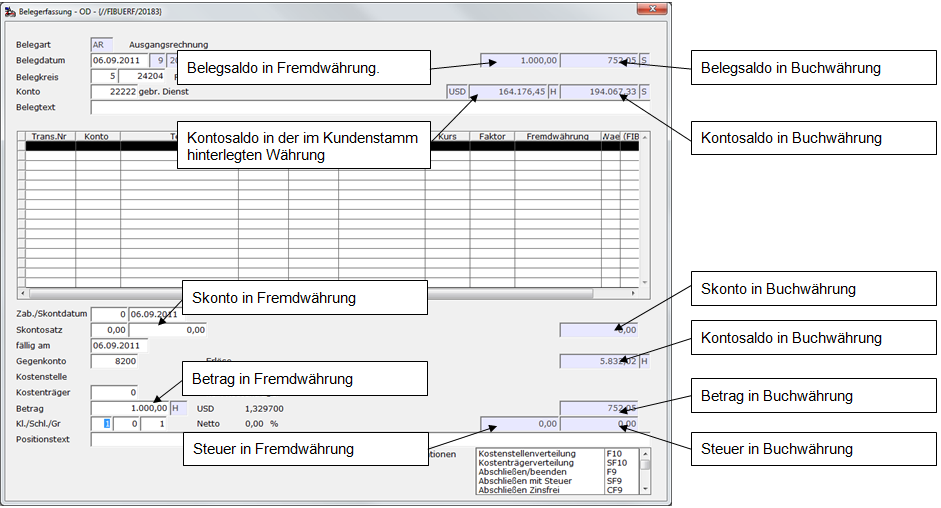
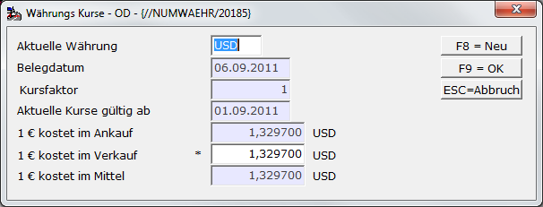
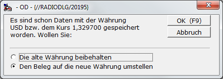

# Erfassung von Fremdwährungsbelegen

<!-- source: https://amic.de/hilfe/erfassungvonfremdwhrungsbelege.htm -->

Hauptmenü > Finanzbuchhaltung > Erfassung > Belegerfassung

Direktsprung **[FIBE]**

Bei der Erfassung von Eingangs- und Ausgangsrechnungen in der Finanzbuchhaltung können die Belege direkt in der Fremdwährung erfasst werden. Es wird für den Kunden/Lieferanten die Währung vorbelegt, die in den Stammdaten bei Währungstyp hinterlegt sind. Dabei werden die im Währungsstamm hinterlegten Einstellungen - wie z.B. Nachkommastellen – verwendet. Der Währungskurs wird anhand der in A.eins hinterlegten [Währungskurse](../stammdaten_der_fibu/waehrungsstammdaten/waehrungskurse/index.md) vorgeschlagen.

Der Betrag, den man erfasst, ist immer der Betrag in der Währung, die hinter dem Betrag steht. Sämtliche Betragsfelder ganz rechts auf der Maske sind in Buchwährung.

 

Ist im Kunden- / Lieferantenstamm als Währung die Buchwährung hinterlegt, dann wird das Feld, in dem der „Kontosaldo in der im Kundenstamm hinterlegten Währung“ angezeigt wird, ausgeblendet. Die Währung des Beleges kann mit der Funktion ***Währung*** **F5** geändert werden.

Hier kann man sowohl die Währung oder den Währungskurs ändern. Bekommt man z.B. von seiner Bank einen Beleg, so ist dort der verwendete Kurs, der u.U. von den Kursen in der Währungskurstabelle abweicht, angegeben. Der Kurs, den man hier eingibt, wird nicht in der Währungstabelle sondern nur im Beleg gespeichert. Es ist immer nur eins der drei Felder mit den Kursen freigeschaltet. Welches der Felder verwendet wird, ist in den [Einrichterparameter](./einrichterparameter_waehrung.md) der Belegerfassung hinterlegt.

Hinter „Aktuelle Kurse gültig ab“ steht das Datum, zu dem die letzten Kurse gepflegt wurden. Stellt man hier fest, dass man die Kurse für diesen Tag noch nicht eingetragen hat, kann man von hier sofort mit **F8** diese Stammdaten eintragen.

Anschließend kommt noch eine Abfrage, falls bereits Daten erfasst wurden:

Rechnungen können immer nur in einer Währung erfasst werden, daher wird immer der gesamte Beleg umgestellt. Bei Zahlungen verhält es sich anders. Dort bezieht sich die Währung immer nur auf die aktuelle Position. Wenn ein Zahlungsbeleg mehrere Währungen enthält, so ist der „Belegsaldo in Fremdwährung“ die Summe der verschiedenen Währungsbeträge, also sozusagen „Äpfel und Birnen“ zusammenaddiert.
