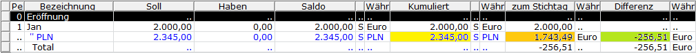
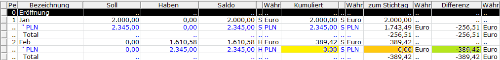
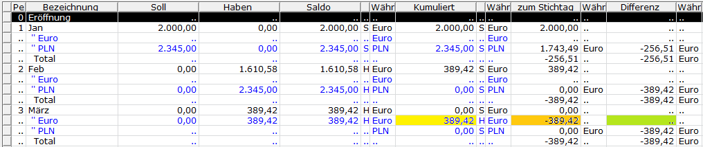

# Konteninformation

<!-- source: https://amic.de/hilfe/konteninformation.htm -->

Hauptmenü > Finanzbuchhaltung > Information > Konteninformation

Direktsprung <strong>[KOI]</strong> bzw. **[KOIP]**

Wenn der Steuerungsparameter „Anzeige Fremdwährung in Auswahllisten“ auf **Ja** steht, dann steht eine weitere Variante „Konteninfo mit Währungsauflösung“ zur Verfügung. Diese zeigt neben der Buchwährung weitere Zeilen an, die die Beträge in der Währung darstellen, in der sie erfasst wurden. Zusätzlich existieren noch zwei weiter Spalten. Eine Spalte „**zum Stichtag**“ zeigt den Fremdwährungsbetrag zum Stichtag (Periodenende) in Buchwährung umgerechnet an. Die Spalte „Differenz“ zeigt die Differenz der Spalte „zum Stichtag“ zu den Beträgen in Buchwährung an, wie sie zum Zeitpunkt der Erfassung in den Belegen festgehalten wurden.

Im folgenden Beispiel wird der Einfachheit halber in Periode 1 eine Rechnung erfasst, in Periode 2 die Zahlung dazu und in Periode 3 die Ausbuchung der Kursdifferenz. Die hier verwendeten Kurse entsprechen nicht den tatsächlichen Kursen.

#### Periode 1:

| | Fremdwährung(PLN) | Tageskurs | Buchwährung(Euro) | Kurs Stichtag(31.01.) | Zum Stichtag(Euro) | Differenz (zum Stichtag - Buchwährung) |
| --- | --- | --- | --- | --- | --- | --- |
| Rechnung | 2.345,00 | 1,1725 | 2.000,00 | | | |
| Kumuliert(PLN) | 2.345,00 | | 2.000,00 | 1,345 | 1.743,49 | \-256,51 |

Darstellung in der Konteninformation: Die Spalte Buchwährung(Euro) wird nicht mit dargestellt.

#### Periode 2:

| | Fremdwährung(PLN) | Tageskurs | Buchwährung(Euro) | Kurs Stichtag(31.01.) | Zum Stichtag | Differenz (zum Stichtag - Buchwährung) |
| --- | --- | --- | --- | --- | --- | --- |
| Zahlung | \-2.345,00 | 1,456 | \-1.610,58 | | | |
| Kumuliert(PLN) | 0,00 | | 389,42 | 1,543 | 0,00 | \-389,42 |

Darstellung in der Konteninformation:

#### Periode 3:

Die Ausbuchung des Kursverlustes erfolgt in Buchwährung. Der Kurs ist daher 1.0000.

| | Fremdwährung(**Euro**) | Tageskurs | Buchwährung(Euro) | Kurs Stichtag(31.01.) | Zum Stichtag | Differenz (zum Stichtag - Buchwährung) |
| --- | --- | --- | --- | --- | --- | --- |
| Ausbuchung | \-389,42 | 1,0000 | \-389,42 | | | |
| Kumuliert(Euro) | \-389,42 | | \-389,42 | 1,0000 | \-389,42 | 0,00 |

Darstellung in der Konteninformation:

Sobald ein Beleg in einer weiteren Währung (hier Buchwährung = Euro) erfasst wurde, wird für jede Periode eine weitere Zeile für diese Währung angezeigt.

Die Differenz ist in der Euro-Zeile immer 0 und wird daher nicht explizit berücksichtigt und daher nicht dargestellt

Bei dieser Darstellung muss der Wert in der Zeile „**Total**“ Spalte „**zum Stichtag**“ immer mit dem Wert in der Spalte „**Differenz“** übereinstimmen. Ist dies nicht der Fall, so werden diese Werte in der Konteninformation gelb hinterlegt.  
Eine Ursache kann eine fehlerhafte manuelle [Kursdifferenz-buchung](./fuehrung_von_devisenkonten.md) sein, die in der Buchwährung durchgeführt wurde.
