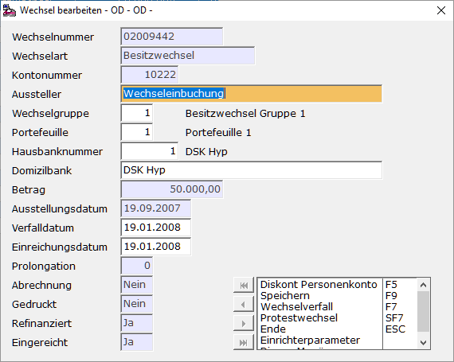
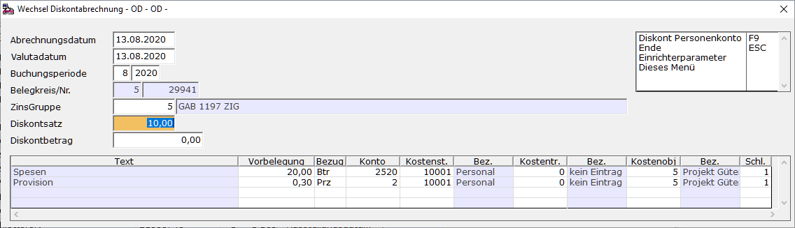

# Die Belegerstellung für den Kunden bzw. Berechnung für Kunde und Lieferant

<!-- source: https://amic.de/hilfe/diebelegerstellungfrdenkundenb.htm -->

Da die Wechselsumme dem Remittenten erst am Verfalltag des Wechsels zur Verfügung steht, er seine Forderung bis dahin also stunden muss, stellt er dem Bezogenen die zwischenzeitlichen Zinsverluste in Rechnung. Diesen Wechselzins nennt man Diskont. Er ist beim Gläubiger (Besitzwechsel) ein Ertrag (Diskontertrag). Zusätzlich zu den Zinsverlusten können dem Besitzwechselinhaber Spesen entstehen. Auch diese Spesen werden dem Bezogenen in Rechnung gestellt.

Bei normalen Warenwechseln sind Diskont und Spesen umsatzsteuerpflichtig.

**Ablauf:**

Hauptmenü \> Mahn-/Zahl-/Zinswesen \> Wechselbuchhaltung > Wechselbearbeiten

Direktsprung **[WEB]**

Wechsel markieren und Ändern mit **F5** drücken:

**Hinweis:**

*Das Einreichungsdatum wird mit dem Verfalldatum vorbelegt, kann jedoch hier geändert werden. Dies ist das tatsächliche Einreichungsdatum, mit dessen Hilfe das Wechselobligo eines Kunden an einem bestimmten Datum bestimmt wird.*

Danach **F5** für Diskont Personenkonto

und **F9**, **ENTER**,

Um die Wechselabrechnung zu drucken **F4**, **ENTER**
